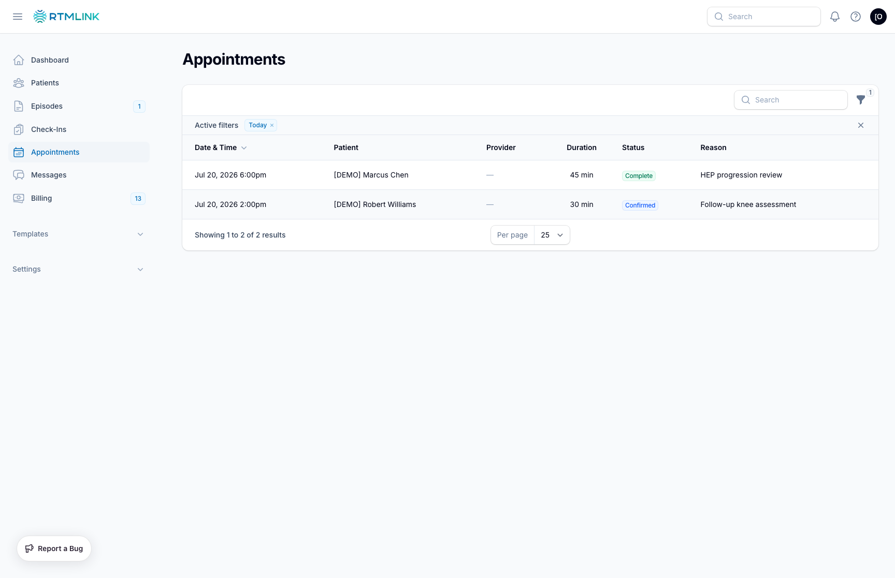

# Viewing appointments

Click **Appointments** in the left sidebar to see the clinic's schedule as a list, newest first. Appointments flow in from your EHR or a CSV import (see [Getting appointments into RTMLink](syncing-appointments.md)); this page is where everyone reads them.

## The list

Each row shows **Date & Time**, **Patient**, **Provider**, **Duration**, **Status**, and the **Reason** for the visit. The **Status** badge is color-coded:

- **Confirmed** and **In Room**: blue
- **Complete**: green
- **Cancelled**: gray
- **No Show**: red

## Filters

The **Today** filter is on by default, so the page opens to today's schedule. Turn it off and use **Provider** or the **From** / **Until** date range to look wider. If the list comes up empty, the page says **No appointments found** and suggests adjusting the date filter.

## Where appointments matter elsewhere

- **The Check-Ins queue** focuses on patients with appointments today, so the morning review matches the schedule. Cancelled, rescheduled, and no-show visits are excluded.
- **The episode page** has an **Appointments** tab with a highlighted **Next Appointment** card, plus upcoming and past lists for that patient.
- **Billing**: claims can be linked to a DrChrono appointment from the claim's **Link Appointment** action, which matters when exporting. See [Exporting to DrChrono](../billing/exporting-to-drchrono.md).

## Role permissions

Everyone in the clinic can view the Appointments page. Importing and syncing are owner and admin actions, covered in [Getting appointments into RTMLink](syncing-appointments.md). Appointments are not created or edited by hand in RTMLink; they mirror your schedule's source of truth.

## Related articles

- [Getting appointments into RTMLink](syncing-appointments.md)
- [The Check-Ins queue](../check-ins/the-check-ins-queue.md)
- [Viewing episode details](../episodes/viewing-episode-details.md)
