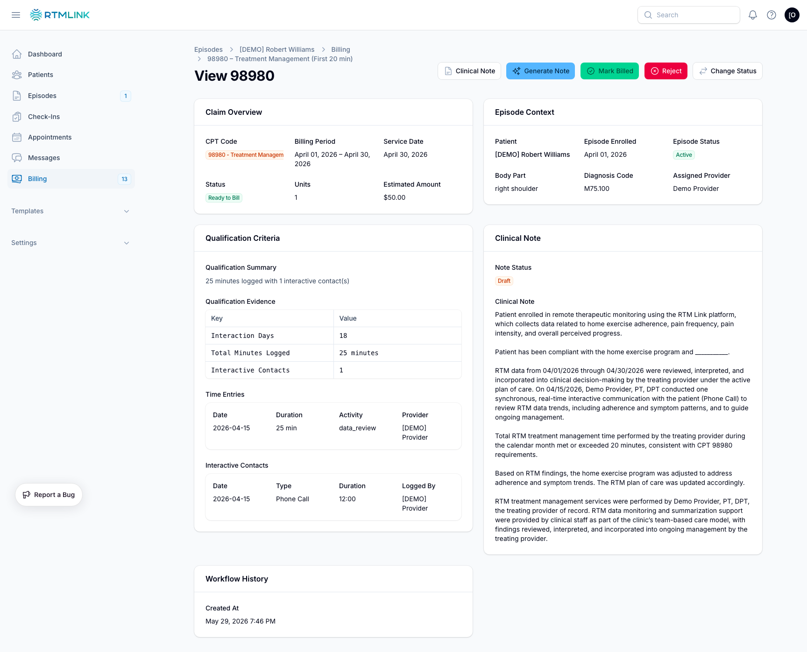

# Billing claims and suggestions

The **Billing** page is your worklist: every claim RTMLink has derived, ready to review, document, and bill. This article covers finding your way around the list, reading a claim's detail page, and the two episode-level tools: manual claims and regeneration.

## Working the list

Open **Billing** in the left sidebar. The **Ready to Bill** tab is your worklist; **Billed**, **Rejected**, and **All** hold the rest. Rows are grouped by patient, and the list refreshes itself every few seconds, so newly qualifying claims appear without a reload.

A row of summary stats sits at the top of the page: **Ready to Bill** (claims awaiting billing), **Est. Revenue** (their estimated total), and **Billed This Month** (labeled with the current month). **Billed This Month** counts the claims marked billed whose service date falls in that month, so a claim keeps counting for the month the care happened, even if someone edits it later.

Because the patient's name is already the group heading, the **Patient** column stays hidden while the list is grouped. Turn grouping off and the column reappears on every row, so you always know whose claim you are looking at. Searching by patient name works either way.

Use the filters to narrow the list:

- **Billing Period** (a from and until date)
- **Provider** (the episode's assigned provider)
- **Clinical Note** (**Signed** or **Needs signature**)
- **CPT Code** (matches a claim if any of its codes match)

## The claim detail page

Click a claim (or choose **View** from its row menu) to open the full picture:

- **Claim Overview**: the CPT code, billing period, service date, status, units, and estimated amount. Manually entered claims carry a **Manual entry** badge. When a claim carries several codes, **Codes on This Claim** lists each one with its own status, because the codes are submitted together on one claim.
- **Episode Context**: the patient, enrollment date, body part, diagnosis code, and assigned provider, with links to jump there.
- **Qualification Criteria**: the evidence behind the claim, including a summary, the counted interaction days or minutes, and each time entry and interactive contact. The time entries and interactive contacts are listed oldest first, so the evidence reads in the order the care happened.

> **Device-supply claims explain their own date here.** A **Date of Service** row names the patient's last day of data, and when the 30-day spacing rule pushed the date out, it says so and names the earlier claim it had to clear. A **Data Counted Through** row appears when the patient was discharged before the period ended, marking the last day whose data could count. These two rows are the only place the date is explained, so start here when a date looks wrong. See [Understanding RTM billing](understanding-rtm-billing.md).
- **Clinical Note**: the note's status, signer, and text. See [Clinical notes and sign-off](clinical-notes.md).
- **Workflow History**: who approved, rejected, or exported the claim and when. The **Last Exported** stamp is informational only; exporting does not change a claim's status.
- **DrChrono Export**: appears once a claim has been sent, with a link to the appointment.

## Adding a manual claim

If your clinic performed billable RTM work the system did not derive (say, a code RTMLink does not calculate automatically), users with billing approval can add it by hand:

1. Open the episode and go to its **Billing Claims** tab.
2. Click **Add Claim**.
3. Pick the **CPT Code**, set **Units** and the **Service Date**, and write a **Justification** (it is recorded for the audit trail and shown as the claim's evidence). A clinical note is optional.

> **Device-supply codes are held to the 30-day rule by hand too.** If you pick a **Service Date** within 30 days of another device-supply claim for the same patient, RTMLink refuses to save and tells you which code and date are in the way, for example "Device-supply claims must be at least 30 days apart. This patient already has a `98977` claim dated 08/20/2026." Editing an existing claim's service date is checked the same way. The check looks across the whole patient, not just this episode, so a claim on their other episode can block a date here.
4. Click **Add Claim**.

The claim is created as **Ready to Bill**. If the episode already has a claim with that code, the form warns you before you save.

> **Manual claims are never touched by the system.** Automatic regeneration will not alter or remove them.

## Regenerating an episode's claims

If an episode's billing data changed (time was corrected, a contact was added late), you can ask RTMLink to re-derive its claims:

1. On the episode's **Billing Claims** tab, click **Regenerate Claims**.
2. Confirm. New qualifying claims are created, stale ones that no longer qualify are removed, and unbilled device-supply claims are re-dated if their date of service has moved.

Protected claims are never affected by regeneration: anything **billed** or **rejected**, **linked to DrChrono**, carrying a **signed clinical note**, or **manually added** stays exactly as it is.

> **A Ready to Bill device-supply claim can change its own date.** Regeneration also runs on a schedule, not only when you click the button, and a claim that is still Ready to Bill is re-dated when the 30-day spacing rule resolves to a different day, or removed if its period no longer yields a claim at all. Downloading a CSV does not lock a claim, so if you hand a batch to your biller and do not mark it billed, a date can still move afterwards. Marking claims billed at the point you export them (or signing the clinical note) is what pins them.

## Related articles

- [Understanding RTM billing](understanding-rtm-billing.md)
- [Approving and rejecting claims](approving-and-rejecting-claims.md)
- [Clinical notes and sign-off](clinical-notes.md)
- [Viewing episode details](../episodes/viewing-episode-details.md)
