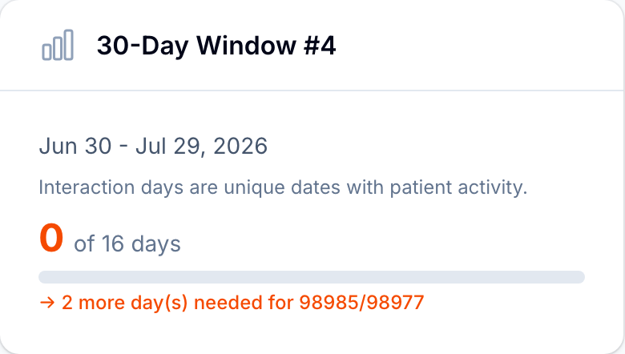
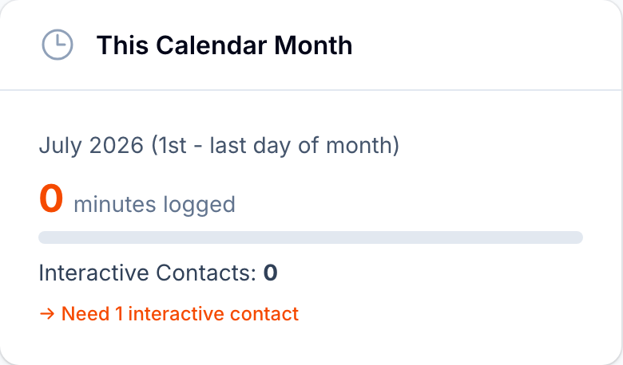

# Tracking billing progress on an episode

Every episode page answers the question "what will this bill, and what is still missing?" at a glance. Two cards in the episode's sidebar track the two billing clocks, and the **Windows** tab keeps the full history.

## The 30-Day Window card

This card tracks the device-supply codes for the current window:

- The window number and its date range.
- **Interaction days**: unique dates with patient activity, counted toward the 16 days needed for `98977`, with a progress bar.
- A status line that tells you exactly where the window stands: how many more days are needed for `98985` or `98977`, or which code the window is on track to earn when it closes.

Device-supply claims are created only after the window closes, so a healthy mid-window episode shows progress here and nothing yet on the **Billing Claims** tab. The tab's banner says when the current window closes and how many interaction days it has so far.

## The This Calendar Month card

This card tracks the treatment-management codes for the current month:

- **Minutes logged** this month on this episode, with a progress bar toward the 20-minute mark.
- **Interactive Contacts** this month.
- A verdict line: what is still needed (more minutes, or an interactive contact), or which treatment code the month is on track to earn.

> **The verdict looks across the whole patient.** Treatment codes bill once per patient per month, so when a patient has activity on more than one episode, the card adds a line with the patient's total minutes and contacts across episodes, and the eligibility verdict follows that total. The headline numbers above it stay specific to this episode.

## The Windows tab

Below the episode's working area, the **Windows** tab lists every 30-day window the episode has had: its dates, status, an **Interaction Days** count against the requirement, and its billing state. Open any row to see the window's full detail, including minutes reviewed, interactive contacts, the billable codes it earned, and, for closed windows, when and why they closed.

## Related articles

- [Understanding RTM billing](understanding-rtm-billing.md)
- [Viewing episode details](../episodes/viewing-episode-details.md)
- [Logging interactive contacts](../episodes/logging-interactive-contacts.md)
