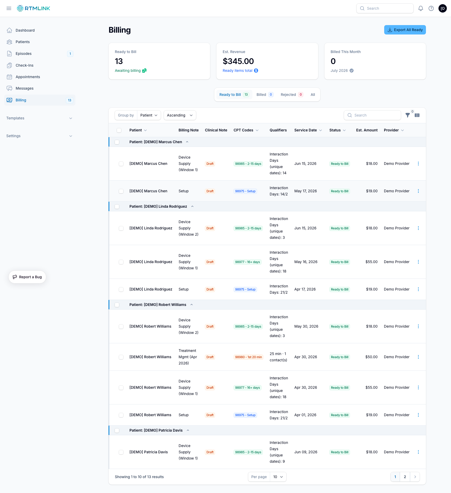
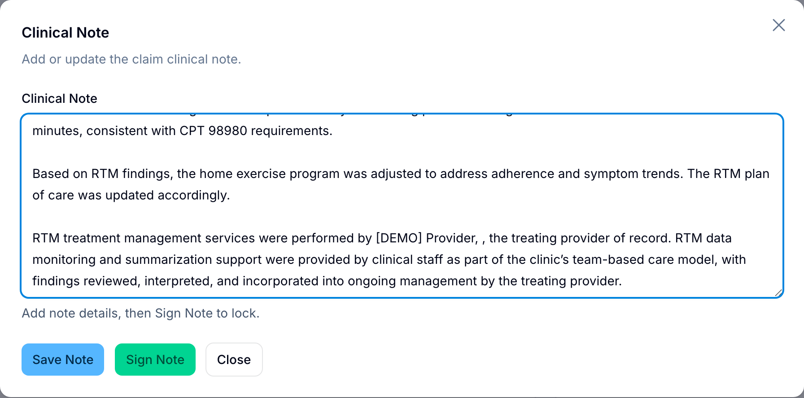

# Clinical notes and sign-off

Every billing claim in RTMLink can carry a clinical note: the written documentation that backs up what the claim bills for. This guide covers writing a note, generating one from a template, signing it so the documentation is locked for the record, and reopening it when something needs to change.

## How claim notes work

- Each claim has one clinical note. For treatment-management claims the note lives on the claim's primary line (`98979` or `98980`); any `98981` add-on lines on the same claim share that note rather than carrying their own.
- The **Clinical Note** column on the Billing page shows where each claim's note stands:
  - **Missing** (gray): no note yet.
  - **Draft** (amber): a note is saved but not signed.
  - **Signed** (green): the note is signed and locked.

## Finding claims that need a signature

1. Click **Billing** in the left sidebar. The **Ready to Bill** tab opens first.
2. Scan the **Clinical Note** column for **Missing** or **Draft** badges.
3. To narrow the list, open the filters and set **Clinical Note** to **Needs signature**. Combine it with the **Provider** filter to see one provider's claims.

> **Providers get a shortcut.** The **Claims to sign** pill in the **Your Action Feed** widget on your dashboard opens Billing already filtered to your own unsigned, ready-to-bill claims, and a weekly email rounds up the same list so nothing sits unnoticed.

## Writing and saving a note

1. On the Billing page, open the claim's action menu and choose **Clinical Note**. (The same button appears at the top of the claim's detail page.)
2. Type or edit the note in the **Clinical Note** box. Notes can hold up to 10,000 characters.
3. Click **Save Note**. The note is kept as a draft, the claim's badge changes to **Draft**, and you can come back and edit it any time before signing.

## Generating a note from a template

If your clinic has set up clinical note templates, you can start from one instead of a blank box:

1. Open the claim's action menu and choose **Generate Note**.
2. The note is written from the template for the claim's CPT code, with the claim's details filled in. Review it and edit anything that needs a human touch.
3. Click **Save Note** to keep it as a draft, or **Sign Note** if it is ready.

> If no template is configured for the claim's CPT code, the window tells you so and you can simply type the note yourself. Clinic Owners manage templates under **Templates** > **Clinical Note Templates** in the left sidebar.

## Signing a note

When the documentation is ready:

1. Open the claim's **Clinical Note** window.
2. Click **Sign Note**.

Signing records you as the signer, along with the date and time, and the badge changes to **Signed**. A note cannot be signed while it is empty; add the note text first.

Once a note is signed:

- It becomes read-only. Nobody can edit it without reopening it first.
- The claim is protected: automatic claim regeneration never changes or removes a claim whose note is signed.
- It leaves your **Claims to sign** count on the dashboard and the weekly reminder email.

> **Signing is a documentation safeguard, not a billing gate.** A claim can still be sent to DrChrono, exported, or marked billed while its note is unsigned. Signing exists so the record shows exactly who approved the documentation, and when. Many clinics make it a habit: sign the note before the claim goes out.

## Reopening a signed note

Spotted something to fix after signing?

1. Open the claim's **Clinical Note** window. The note appears read-only, with **ReOpen Note** in place of the save and sign buttons.
2. Click **ReOpen Note**. The signature is cleared and the note becomes editable again.
3. Make your changes, then **Save Note** or **Sign Note** as usual.

Reopening removes the previous signature entirely, so remember to sign again once your edits are done.

## Role permissions

| Action | Clinic Owner | Provider | Staff | Billing Staff | Auditor |
| --- | --- | --- | --- | --- | --- |
| View Billing and read notes | Yes | Yes | No | Yes | Yes |
| Save, sign, and reopen notes | Yes | Own patients only | No | Yes | No |

Providers can write and sign notes only on claims for their own assigned patients.

## Related articles

- [Viewing episode details](../episodes/viewing-episode-details.md)
- [Navigating the dashboard](../getting-started/navigating-the-dashboard.md)
- [Understanding your role](../getting-started/understanding-your-role.md)
