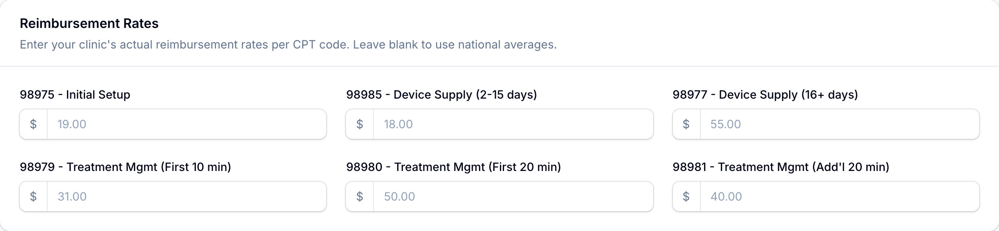

# Configuring billing rates

The revenue estimates you see across RTMLink (the **Est. Revenue** card, each claim's **Est. Amount**, and the CSV export) come from per-code rates your clinic controls. Only the **Clinic Owner** can change them.

## Where the settings live

1. In the left sidebar, open **Settings** and choose **Clinic Settings**.
2. Scroll to the **RTM Billing** and **Reimbursement Rates** sections.

> Not to be confused with **Invoices**, which sits in the same Settings group: that page manages your clinic's own RTMLink subscription (plan, payment method, invoices), not patient billing.

## Reimbursement rates

The **Reimbursement Rates** section has one dollar field per RTM code, from `98975` through `98981`. Each field's placeholder shows the current **national average** for that code:

- Leave a field **blank** to use the national average in all revenue estimates.
- Enter your clinic's actual contracted rate to make estimates match reality.

Changes apply immediately to every estimate in the app. Estimates are exactly that: rate times units, shown so you can prioritize work, not a promise of payment.

## When the setup code surfaces

The **RTM Billing** section has one more control: **98975 minimum interaction days**. CMS allows `98975` (initial setup) to be billed without any patient interactions, but most clinics prefer to wait until the patient has actually engaged for a few days. This setting is that waiting period:

- The default is **2**: the setup claim is suggested once the patient has been active on 2 different days (any answered check-in question, submitted check-in, or completed exercise counts).
- Set it to **0** to suggest the setup claim immediately on enrollment.

## Role permissions

Changing rates and the `98975` preference requires the billing settings permission, which only the **Clinic Owner** holds. Billing Staff work the claims list but do not set rates.

## Related articles

- [Understanding RTM billing](understanding-rtm-billing.md)
- [Billing claims and suggestions](billing-suggestions.md)
