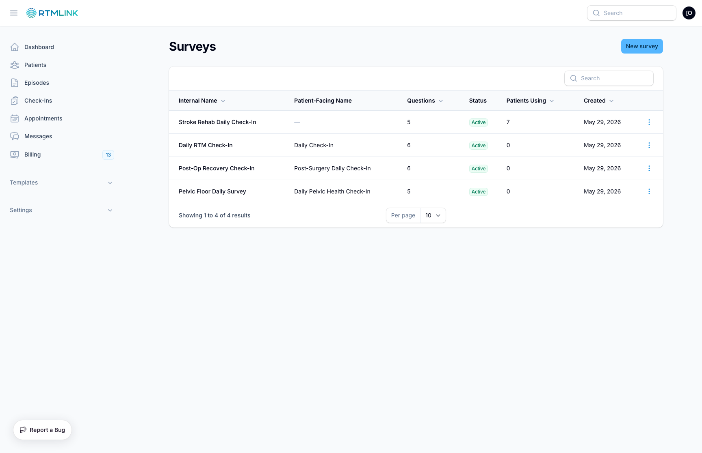

# Creating a survey

A survey is built from questions you choose and arrange. You can start from scratch or [duplicate an existing survey](editing-and-managing-surveys.md#duplicating-a-survey) and adjust it. This article covers building one from scratch.

To begin, open **Check-In Templates** in the sidebar (under **Templates**) and click **New survey**.

## Survey details

The top section names the survey and sets its status:

- **Internal Name**: required. Your team's label for the survey.
- **Patient-Facing Name**: optional. What patients see at the top of their check-in. Leave blank to reuse the internal name.
- **Description**: optional notes for your team.
- **Status**: on by default. An active survey can be assigned to new episodes; an inactive one can't.
- **Default Survey**: off by default. The default is pre-selected whenever you enroll a patient. Turning this on makes the survey active and clears the previous default. (See [survey status](understanding-surveys.md#survey-status).)

## Adding questions

Below the details is the **Questions** section. Every survey needs at least one question. Click **Add Question** to add more, and drag the handle on any question to reorder them. Use **Collapse all** / **Expand all** to manage a long list.

Each question has:

- **Question Text**: required. The question as the patient reads it.
- **Question Type**: how the patient answers (see below).
- **Analytics Category**: optional. Tag the question (Pain Intensity, Pain Frequency, Home Exercise Program, Activity Level, Sleep Quality, Global Rating of Change, Mood, Notes, or Custom) so RTMLink can chart it over time.
- **Featured**: when on, this question appears as its own column in the patient's episode, so key answers are visible at a glance.

> All questions are currently **optional** for the patient; they can skip any question. You don't set required/optional per question.

### Question types

| Type | What the patient does | Extra settings |
|------|----------------------|----------------|
| **Scale (0-10)** | Picks a number on a scale. | **Scale Min** / **Scale Max** (max can't exceed 10), and optional **Min Label** / **Max Label** to caption the ends (e.g. "No pain" → "Worst pain"). |
| **Multiple Choice** | Picks one option. | **Answer Options**: add at least two, each with a **Label** (what the patient sees) and a **Value** (recorded internally). |
| **Yes/No** | Picks Yes or No. | Starts with **Yes** and **No** options ready to use. |
| **Numeric Input** | Types a number. | **Scale Min** / **Scale Max** to bound the value. |
| **Free Text** | Types a sentence or two. | None. |

### Flagging answers with alerts

You can have specific answers raise an alert so the response is flagged for follow-up.

- For **Multiple Choice** and **Yes/No**, each answer option has an **Alert** toggle.
- For **Scale** and **Numeric** questions, add **Alert Thresholds**: a **Threshold Value** that, when the patient's answer matches it, triggers the alert.

When you turn on **Alert**, set:

- **Severity**: **Low**, **Medium**, or **High** (defaults to Medium).
- **Alert Message**: optional text explaining what the flag means (e.g. "Pain ≥ 8: call patient").

Flagged responses are highlighted when you review them and can be surfaced with the episode list's **Attention** filter. See [Understanding survey responses](understanding-survey-responses.md).

## Saving

Click **Create**. Your new survey appears in the list. From there you can [preview it](previewing-a-survey.md) to see exactly what the patient will see, or assign it when you [enroll a patient](../episodes/enrolling-a-patient.md).

## Related articles

- [Understanding surveys](understanding-surveys.md)
- [Editing & managing surveys](editing-and-managing-surveys.md)
- [Previewing a survey](previewing-a-survey.md)
- [Understanding survey responses](understanding-survey-responses.md)
