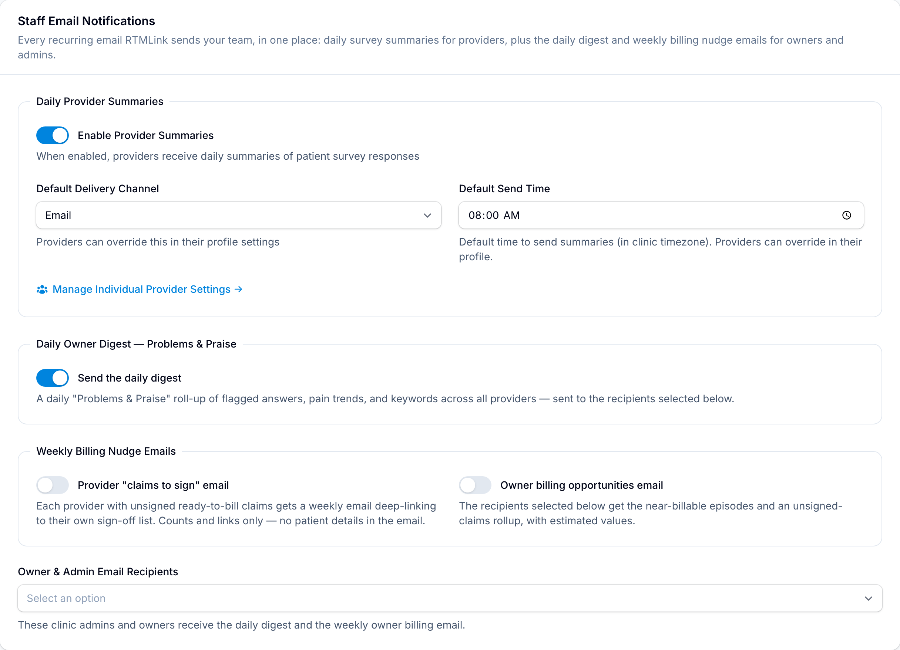

# Summary notification settings

Daily summaries have three layers of settings: clinic-wide defaults, per-provider overrides an owner manages, and a self-service page each provider controls. All three live a click apart.

## Clinic defaults

Open **Settings** > **Clinic Settings** and find the **Staff Email Notifications** section. It gathers every recurring email RTMLink sends your team; the part that governs summaries is the **Daily Provider Summaries** group:

- **Enable Provider Summaries**: the master switch for the whole clinic.
- **Default Delivery Channel**: **Email** or **SMS**. Providers can override this for themselves.
- **Default Send Time**: when summaries go out (clinic timezone), unless a provider sets their own.

The same section also holds the daily owner digest (the "Problems & Praise" roll-up of flagged answers and trends), the weekly billing nudge emails, and the **Owner & Admin Email Recipients** list that both owner emails share.

## Per-provider overrides (owner-managed)

Click **Manage Individual Provider Settings** inside that section to open the **Provider Notifications** page: one row per provider showing **Summaries** on or off, their **Channel**, and their **Send Time** (rows read **Clinic default** until someone overrides).

Click **Edit** on a row to set, per provider:

- **Receive daily survey summaries**: on or off for just this provider.
- **Delivery Channel**: **Use clinic default**, **Email**, or **SMS**.
- **Send Time**: **Fixed time each day** with a **Send At** time, or **Hours before first appointment** (1 to 12 hours). The appointment option only fires on days the provider has appointments.
- **SMS Phone Number**: an override number for text delivery.

Saving confirms with a toast naming the provider.

## A provider's own settings

Providers manage the same choices for themselves: open the user menu, choose **My Settings**, and find **Survey Summary Notifications**. The fields mirror the owner's edit form, and saving confirms with **Notification settings updated**.

> When both exist, the provider's own settings and the owner's per-provider settings are one and the same; whoever saved last wins. Blank fields fall back to the clinic defaults.

## The review-time estimate

The minutes pre-filled on the review page come from the **Time Estimate Formula** section of Clinic Settings: **Seconds per Response**, **Seconds per Flag**, **Seconds per Comment**, and a **Minimum Minutes per Patient** floor. Tune these if your team's pre-filled estimates consistently run high or low.

## Role permissions

| Action | Clinic Owner | Provider | Staff | Billing Staff | Auditor |
| --- | --- | --- | --- | --- | --- |
| Clinic defaults and the Provider Notifications page | Yes | No | No | No | No |
| Their own My Settings preferences | Yes | Yes | Yes | Yes | Yes |

## Related articles

- [Daily summary emails and texts](daily-summary-notifications.md)
- [The Check-Ins queue](the-check-ins-queue.md)
- [Understanding your role](../getting-started/understanding-your-role.md)
