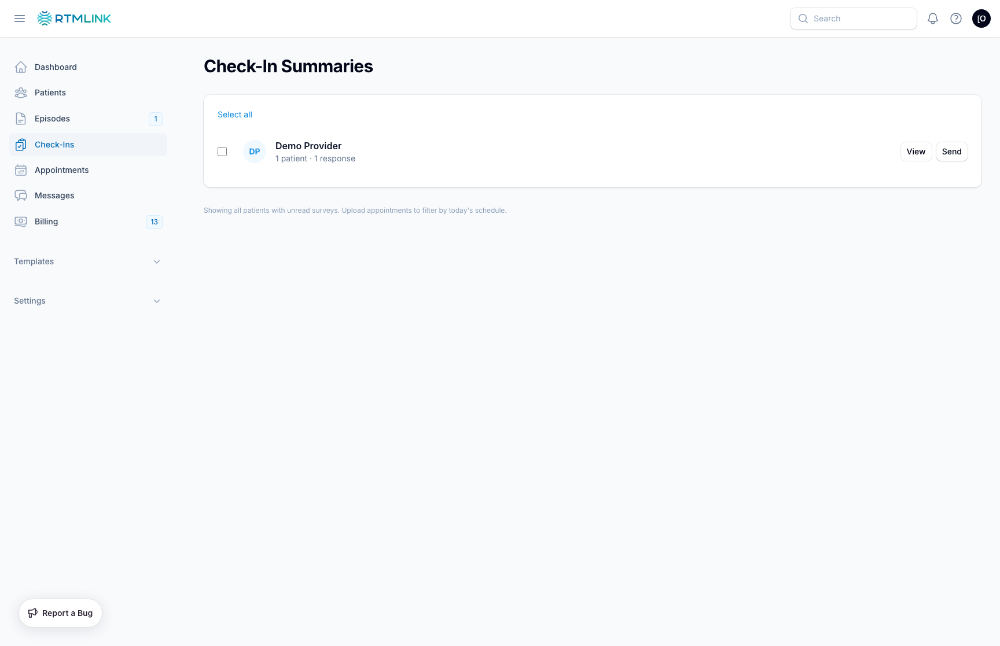

# The Check-Ins queue

Click **Check-Ins** in the left sidebar to open the **Check-In Summaries** page: a live queue of every provider who has unread patient responses waiting. It is computed on the spot from unread check-ins, so there is nothing to generate and nothing goes stale; the moment a provider reviews their responses, the queue updates.

## Reading the list

Each row is one provider:

- **Providers with unread responses** show an initials avatar and a count line such as **3 patients · 7 responses**.
- **Providers who finished** show a green check and **Reviewed · 5 surveys read today**, and sink to the bottom of the list.

When nobody has anything waiting, the page says **All caught up!** with a note that no providers have unread survey responses.

## Opening a provider's review

Click anywhere on a row (or its **View** button) to open that provider's review page, where responses are read and time is logged. See [Reviewing daily check-ins](reviewing-daily-check-ins.md).

## Sending summaries on demand

Providers normally receive their summary automatically by email or text (see [Daily summary emails and texts](daily-summary-notifications.md)), but you can push one at any moment:

1. Click **Send** on a provider's row and confirm. A toast reports **Email queued** and the summary goes out shortly.
2. To nudge several providers at once, use **Select all** (or tick individual rows), then click **Send N selected** and confirm.

## The appointments filter

A footer line tells you which mode the queue is in:

- **Filtered to patients with appointments today**: the clinic has appointment data, so the queue focuses on today's schedule.
- **Showing all patients with unread surveys**: no appointment data for today, so every unread response counts.

If your clinic has no connected EHR, a **clinic owner** can select **Upload Appointments** at the top of the page to import today's schedule and turn on the filter. This button appears only for clinic owners, and only when no EHR is connected; if you are not an owner, ask your clinic owner to upload the schedule.

## Where the counts surface

- Owners and admins see an **Unread Surveys** number on the dashboard; it is the same count as this queue and links straight here.
- Providers get their own personal entry point: the **Surveys to review** pill in the dashboard's **Your Action Feed**, which opens their review page directly and counts only their assigned patients.

## Role permissions

| Action | Clinic Owner | Provider | Staff | Billing Staff | Auditor |
| --- | --- | --- | --- | --- | --- |
| Open the Check-Ins queue | Yes | Yes | Yes | Yes | Yes |
| Send summaries from the queue | Yes | Yes | Yes | Yes | No |
| Upload today's appointments | Yes | No | No | No | No |
| Review and log time on a summary | Yes | Own summary only | No | No | No |

## Related articles

- [Reviewing daily check-ins](reviewing-daily-check-ins.md)
- [Daily summary emails and texts](daily-summary-notifications.md)
- [Understanding survey responses](understanding-survey-responses.md)
