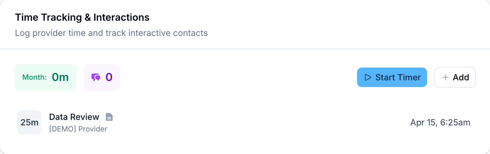
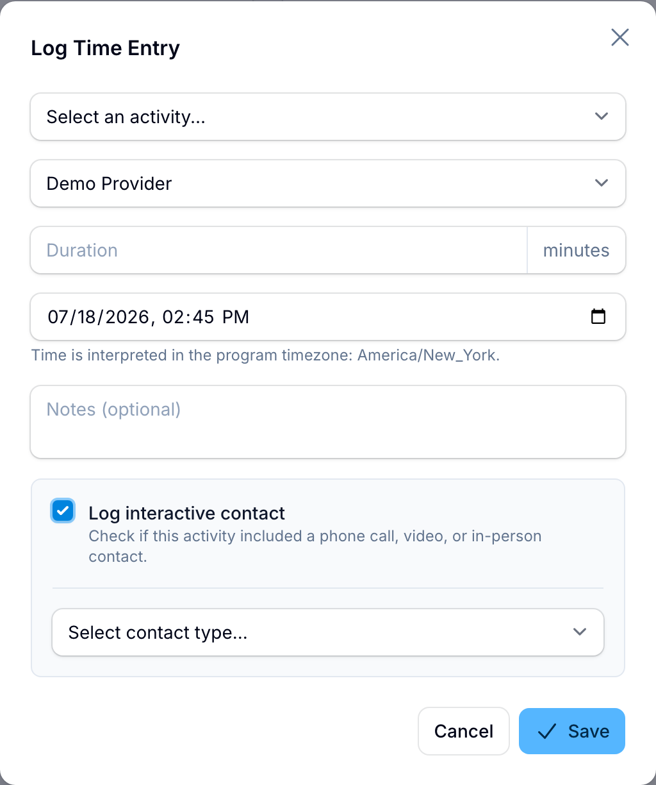

# Logging interactive contacts

Treatment-management billing needs more than logged minutes: it also requires at least one real-time contact with the patient each calendar month. RTMLink calls these interactive contacts, and you record one in the same window you use to log provider time. This guide shows you where.

## What counts as an interactive contact

An interactive contact is a live, two-way conversation with the patient:

- **Phone call**
- **Video call**
- **Synchronous chat** (a live back-and-forth, not a message left for later)
- **In-person** conversation

Asynchronous messages, like texts or portal messages the patient reads later, do not qualify. At least one qualifying contact is required each calendar month before the treatment-management codes (`98979`, `98980`, and `98981`) can be billed for that month.

## Where the episode shows contacts

Open the patient's episode and find the **Time Tracking & Interactions** section. Its header shows two counters for the current month: minutes logged (green) and interactive contacts (purple). The **This Calendar Month** card on the same page counts **Interactive Contacts** too, and when the month has none yet, its status line reads **Need 1 interactive contact** so you know exactly what is missing.

You may also be pointed here from your dashboard: when an episode has enough minutes but no contact, the revenue opportunities list shows **Log 1 interactive contact to bill** the eligible code, and its **Add Interaction** button jumps straight to this section of the episode.

## Log a contact with a time entry

Interactive contacts ride along with time entries, so you record the conversation and the time it took in one step:

1. Open the episode and go to **Time Tracking & Interactions**.
2. Click **Add**. (If you tracked the conversation live with **Start Timer**, clicking the stop button opens the same window with the elapsed minutes already filled in.)
3. In the **Log Time Entry** window, choose the activity. For a call, pick **Live Communication (Phone/Video Call)**; the contact checkbox below will be marked **(Recommended)**.
4. Confirm the provider, enter the **Duration** in minutes (1 to 480), and set when it happened. As the on-screen note says, the time is interpreted in the program timezone.
5. Add notes if you like.
6. Check **Log interactive contact**, then choose the contact type: **Phone call**, **Video call**, **Synchronous chat**, or **In-person**.
7. Click **Save**.

The time entry and its interactive contact are saved together. The purple counter ticks up, the **This Calendar Month** card updates, and the contact appears as supporting evidence on any treatment claim for that month.

> **Tip:** The checkbox works with any activity type, not just live communication. If a care-coordination visit included a real conversation with the patient, you can log the contact on that entry too. Just leave the box unchecked for work that did not include one; opening a survey or sending a message is not an interactive contact.

## Editing or removing a contact

Time entries for the episode are listed below the section. Click an entry to reopen it:

- The **Log interactive contact** checkbox reflects whether a contact is attached. Uncheck it and save to remove the contact while keeping the time entry.
- Check it and pick a type to add a contact to an entry that did not have one.
- **Delete** removes the time entry along with its attached contact.

## Logging contacts during survey review

Providers reviewing the day's survey responses can also log an interactive communication right from the review screen, one patient at a time, without opening each episode. The review page will remind you if any patient you reviewed still has no contact this month.

## Role permissions

| Action | Clinic Owner | Provider | Staff | Billing Staff | Auditor |
| --- | --- | --- | --- | --- | --- |
| Log time and interactive contacts | Yes | Yes | Yes | Yes | No |
| See everyone's entries | Yes | Own entries only | Yes | Yes | Yes |

## Related articles

- [Viewing episode details](viewing-episode-details.md)
- [Understanding episodes](understanding-episodes.md)
- [Understanding your role](../getting-started/understanding-your-role.md)
