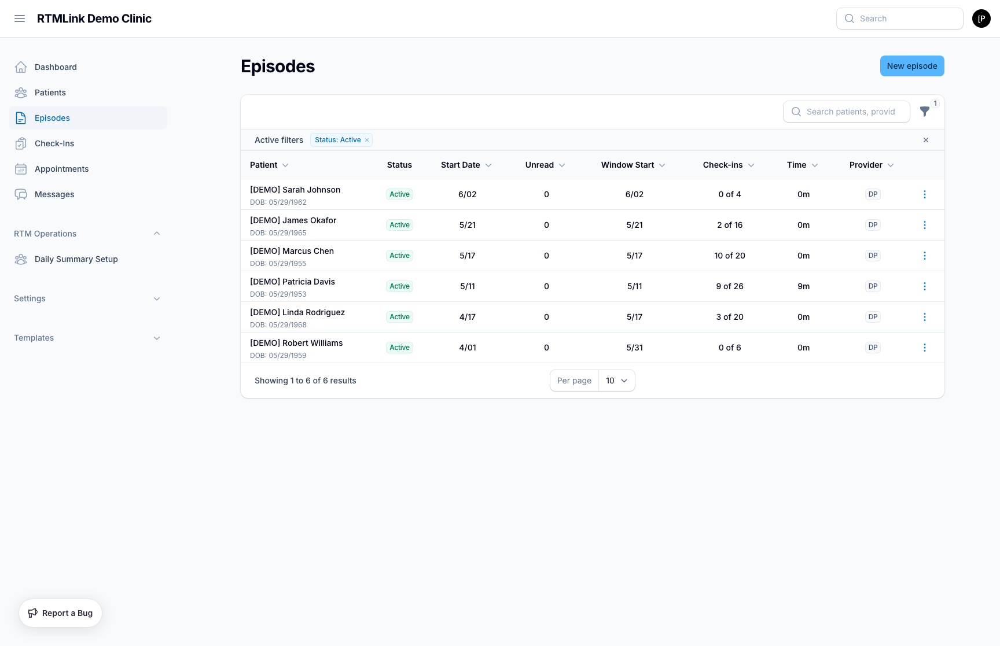

# Viewing episode details

The episode detail page is your hub for a single patient's monitoring. It shows who is being monitored, how the two billing clocks are progressing, the survey schedule, every response, and where the episode stands for billing.

## Opening an episode

1. Click **Episodes** in the left sidebar to see your episodes.
2. Click a patient's name to open their episode.

You can also reach an episode from the patient's record by choosing **View Episode**.

## The page heading

At the top of the page you will see the patient's name, followed by a status badge (**Active**, **Paused**, **Completed**, or **Discharged**) so you can tell at a glance where the episode stands.

- Click the copy icon next to the name to copy the patient's full name to your clipboard (handy when you are looking them up in another system or reading it to someone over the phone).
- Just under the name, a line shows the assigned **Provider**, when the episode started, and the patient's date of birth.
- The buttons across the top let you act on the episode: start a time tracking timer, message the patient, resume it if it is paused, and edit its details. See [Episode actions](episode-actions.md).

## The summary rail

Down the side of the page you will find at-a-glance cards. Two of them track billing, one per billing clock, so the figures never read as a single number. See [Understanding the two billing clocks](#understanding-the-two-billing-clocks) below for why they are kept separate.

### 30-Day Window

Progress toward the device-supply codes (`98985` and `98977`), which are earned over the current 30-day window:

- The window's date range.
- **Interaction days:** unique dates with patient activity, shown as a running count toward 16 days, with a progress bar.
- A status line telling you how many more interaction days are needed, or which code the window is on track to earn when it closes.

> The card title shows the window number when one is active, for example **30-Day Window #2**.

### This Calendar Month

Progress toward the treatment-management codes (`98979`, `98980`, and `98981`), which are earned over the calendar month (the 1st through the last day):

- **Minutes logged:** total provider time recorded this month, with a progress bar.
- **Interactive Contacts:** the number of live contacts (phone, video, or in person) this month.
- A status line telling you what is still needed (for example, an interactive contact or more minutes), or which code the month is on track to earn.

> **The verdict follows the patient, not just this episode.** The minutes and contacts at the top of the card are this episode's, but the eligibility line reflects the patient's whole month, because treatment codes bill once per patient per month. If another of the patient's episodes contributed activity, an extra line shows the patient's combined total across episodes and notes that the codes bill on the most recent episode with activity.

### Episode Details

- **ICD-10 Codes:** diagnosis codes recorded on the episode, if any.
- **Pause Reason:** shown only while the episode is paused.
- **Discharge Date:** shown only after the episode is discharged or completed.
- **Continues From:** shown only when this episode continues an earlier one, with a link back to it.
- **Assigned Survey**, **Frequency**, **Send Time**, **Communication Methods:** the schedule set at enrollment. See [How often surveys are sent](enrolling-a-patient.md#how-often-surveys-are-sent).
- **RTM Consent:** a colored badge showing where the patient's RTM program consent stands. It reads **Accepted** (green, noting how consent was obtained, online, verbal, or paper form, along with the witness and date), **Pending patient agreement** (amber, while the patient has not yet agreed online), or **Declined** (red). This badge appears only when consent was captured for the episode; episodes enrolled before your clinic started requiring RTM consent have none. See [Enrolling a patient](enrolling-a-patient.md) for how consent is recorded.
- **Survey Link:** the patient's personal survey link. Click the copy icon to copy it (handy for reading the link to a patient over the phone).

## The working area

The main part of the page is where you do the day-to-day work:

- **Patient Responses:** recent survey responses and exercise feedback. Flagged answers are highlighted so you can spot anything that needs attention. See [Understanding survey responses](../check-ins/understanding-survey-responses.md).
- **Time Tracking & Interactions:** log provider time and record interactive contacts (phone, video, in person) against the episode. See [Episode actions](episode-actions.md).

> **Export the response history.** When the patient has responses or exercise logs on file, an **Export CSV** button appears at the top of the **Patient Responses** panel. It downloads the episode's full response history, plus exercise feedback, as a spreadsheet you can open in Excel or Google Sheets: every answer is its own row, with times shown in the patient's time zone. Because the file contains patient health information, opening the download is recorded in your clinic's activity history.

## Understanding the two billing clocks

RTM pays on two separate schedules, so the page tracks them with two separate cards that will rarely show matching numbers:

- **Device-supply codes (`98985`, `98977`)** are earned over the rolling **30-day window** and are based on **interaction days** (unique dates the patient was active). This is the **30-Day Window** card.
- **Treatment-management codes (`98979`, `98980`, `98981`)** are earned over the **calendar month** and are based on **provider minutes** plus at least one **interactive contact**. This is the **This Calendar Month** card.

Because one clock counts days over a 30-day window and the other counts minutes over a calendar month, the two cards measure different things over different periods. Seeing different numbers is normal.

## Detail tabs

Below the working area, four tabs let you view and manage more episode data:

- **Appointments:** upcoming and past appointments linked to this patient.
- **Billing Claims:** all billing claims generated for this episode. Click any row to open the full claim detail: CPT code, billing period, service date, qualification evidence, clinical note, and workflow history. Users with billing approval access also see two actions in the tab header:
  - **Add Claim:** manually enter a claim for a code the system did not derive automatically. Manual claims are marked Ready to Bill and are never overwritten by automatic regeneration.
  - **Regenerate Claims:** re-evaluate all billing data for this episode. Stale claims (suggested, approved, or rejected) that no longer qualify are removed; new qualifying claims are created. Claims that have been exported, billed, linked to DrChrono, or have a signed clinical note are never affected.
- **Exercises:** exercises assigned to this episode. See [Assigning HEP to an episode](../exercises/assigning-hep-to-an-episode.md).
- **Windows:** the full history of 30-day billing windows. Click any row to see its detail: window number, date range, status, interaction days, minutes reviewed, interactive contacts, and the billable codes that were earned.

> **Note:** The **Billing Claims** tab shows a banner telling you when the current window closes and how device-supply claims surface (`98985` for 2 to 15 interaction days, `98977` for 16 or more). Those claims are generated after the 30-day window closes, so you typically see this tab mid-window with no device-supply claims listed yet.

## Related articles

- [Understanding episodes](understanding-episodes.md)
- [Managing episode status](managing-episode-status.md)
- [Episode actions](episode-actions.md)
- [Understanding survey responses](../check-ins/understanding-survey-responses.md)
