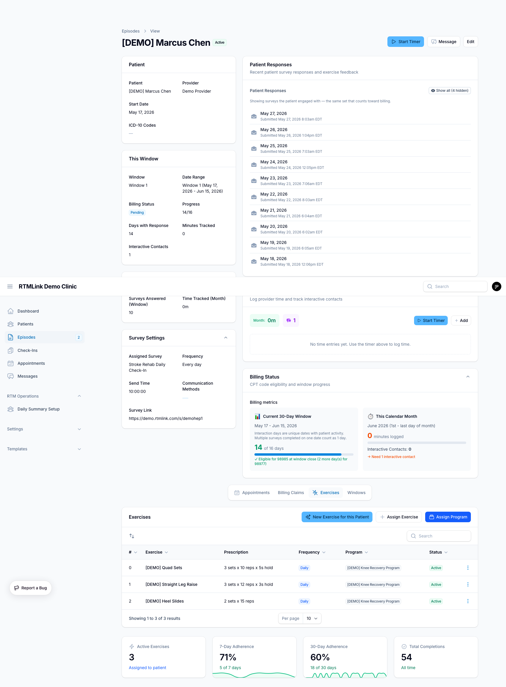

# Assigning HEP to an episode

You give a patient their exercises from the **Exercises** tab on their episode. This is where a patient's Home Exercise Program actually lives — the [library](the-exercise-library.md) and [programs](exercise-programs.md) are your reusable building blocks; here you put them to work for one patient.

Open the patient's episode and select the **Exercises** tab.

## Three ways to add exercises

Across the top of the tab:

- **Assign Exercise** — add a single exercise from your library.
- **Assign Program** — add every exercise in a [program](exercise-programs.md) at once.
- **New Exercise for this Patient** — create a brand-new exercise that's [locked to this patient](the-exercise-library.md#patient-specific-exercises) (for their own photos or video) and assign it in the same step.

### Assign a single exercise

**Assign Exercise** opens a dialog:

- **Exercise** — search your library and pick one.
- **Prescription Overrides** — **Sets**, **Reps**, **Hold (sec)**, and **Rest (sec)**. **Leave these blank to use the exercise's defaults**; fill them in only to tailor this patient's prescription.
- **Frequency** — how often the patient should do it (options below).
- **Notes** — a note the patient sees with the exercise.

Click **Assign**.

### Assign a whole program

**Assign Program** opens a dialog where you pick an **Exercise Program**. Every exercise in it is added to the episode at once.

> **A program becomes individual exercises on the episode.** Once assigned, each exercise stands on its own — you can edit or deactivate any of them per patient, and later changes to the source program don't touch this patient.

## Frequency options

| Option | Meaning |
|--------|---------|
| **Daily** | Every day. |
| **Twice daily** | Two times a day. |
| **3x per week** | Three days a week. |
| **Every other day** | Every second day. |
| **As needed** | No fixed schedule. |

Frequency is optional — leave it as **Not set** if you'd rather not specify one.

## Reading the assigned exercises

| Column | What it shows |
|--------|---------------|
| **#** | The order the patient does them in — **drag rows to reorder**. |
| **Exercise** | The exercise name. |
| **Prescription** | The effective sets, reps, and hold — e.g. **3 sets × 10 reps × 30s hold**. Blank overrides fall back to the exercise's defaults. |
| **Frequency** | How often, if set. |
| **Program** | The program it came from, or **Individual** if added on its own. |
| **Status** | **Active** or **Inactive**. |

## Editing and removing exercises

On any active exercise's actions menu:

- **Edit Prescription** — change the sets, reps, hold, rest, frequency, or notes for this patient.
- **Deactivate** — take the exercise out of the patient's active program. It stays in the episode's history and can still be viewed; it just stops appearing in the patient's exercises.

> **Deactivate, not delete.** RTM is a billable medical service, so an exercise the patient already worked on is never erased — deactivating takes it out of their current routine while preserving the record.

## Related articles

- [Understanding the Home Exercise Program](understanding-hep.md)
- [The exercise library](the-exercise-library.md)
- [Exercise programs](exercise-programs.md)
- [Tracking exercise adherence](tracking-exercise-adherence.md)
- [The patient's exercise experience](the-patient-exercise-experience.md)
