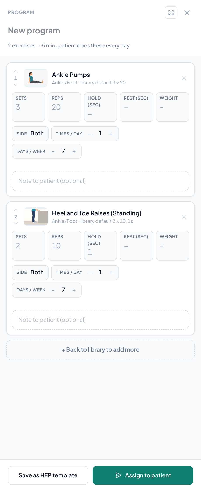

# Building a patient's exercise program

A patient's **program** is the set of exercises they do at home. You build one by collecting exercises from the [exercise library](the-exercise-library.md), setting how much and how often, and then either **assigning it to a patient** or **saving it as a HEP template** you can reuse.

The same program builder handles three jobs:

- **Start a new program** from the library and assign it to a patient.
- **Change a patient's current program** (their exercises load in, you adjust, then click **Update program**).
- **Save a set of exercises as a HEP template** for next time. See [HEP templates](hep-templates.md).

> **Your program is a draft until you act on it.** It belongs to you, and it stays in place while you move around the exercise pages. Nothing reaches a patient or your library until you assign it, update it, or save it as a HEP template.

## Which way to start

- **Enrolling someone new?** Add their first exercises in the **Assign exercises** section of the enrollment form, then fine-tune them later with **Manage program**. See [Assigning exercises during enrollment](assigning-hep-to-an-episode.md#assigning-exercises-during-enrollment).
- **Changing what a patient already does?** Open their episode, select the **Exercises** tab, and click **Manage program**. Their current exercises load in, you edit them in place, and their history is kept.
- **Starting from a template you've saved?** Click **For a patient** and pick the patient, then open the template on the **HEP Templates** tab. Adjust any doses for this patient and click **Update program**.
- **Tailoring a program to one patient?** Click **For a patient** before you add anything. Picking the patient first also shows any exercises that are private to them.
- **Building a routine to reuse?** Add exercises without picking a patient, then click **Save as HEP template**.

## Step 1: Add exercises

1. Click **Exercises** in the left sidebar.
2. Find an exercise by searching or filtering (see [Finding exercises](the-exercise-library.md#finding-exercises)).
3. Click the round **+** button on its card. The button turns into a check mark, meaning the exercise is in your program.
4. Repeat for each exercise.

You can also open an exercise's details and click **Add to program**.

As soon as your program has an exercise, a dark **program bar** appears at the top of the library, for example **Program · 4 exercises · ~8 min**. Click **Clear** on the bar to empty it and start over.

> **Just made a new exercise?** On the New exercise form, **Save and add to program** creates the exercise and drops it straight into your program.

## Step 2: Review and set the prescription

Click **Review program** on the program bar. A panel slides in from the right with every exercise in your program.

1. **Name the program** (optional): click the name at the top to rename it.
2. For each exercise, set the prescription:
   - **Sets**, **Reps**, **Hold (sec)**, and **Rest (sec)**: leave any of these blank to use the exercise's library default. The default shows in gray inside the field and under the exercise name (for example, "library default 3 × 10, 5s").
   - **Weight**: free text, so write it the way the patient should read it (for example, "5 lb" or "green band").
   - **Side**: click to cycle through **Both**, **Left**, and **Right**.
   - **Times / day**: use **−** and **+** to set how many times a day (1 to 6).
   - **Days / week**: use **−** and **+** to set how many days a week (1 to 7). Seven days means every day.
   - **Note to patient (optional)**: a short note the patient sees with the exercise (up to 500 characters).
3. Use the up and down arrows beside each exercise's number to put them in the order the patient should do them.
4. Click the **×** on an exercise to remove it, or **+ Back to library to add more**.

The line under the program name sums it up, for example **4 exercises · ~8 min · patient does these 3 days a week**. The minutes are a rough estimate based on sets, reps, and hold time.

> **Prefer a table?** Click the expand icon at the top of the panel to open the full-screen **Review program** page. It has the same fields in rows, plus a bar at the bottom where you can type an exercise name and press Enter to add it without touching the mouse. Click any exercise's name or picture for a large preview with its illustration or video and steps. Click **Library** to go back.

## Step 3: Assign it to a patient

1. At the bottom of the panel, click **Assign to patient**.
2. Under **Patient · episode**, search for the patient and click their episode. Only **active** and **paused** episodes are listed, with your own patients first.
3. Decide whether to tell the patient (see [Notifying the patient](#notifying-the-patient) below).
4. Check the **Patient preview** on the right. It shows the exercises the way the patient will see them. If the program includes an exercise that's been deleted from your library, the window lists it as not assigned.
5. Click **Assign & send** (or **Assign** if you're not sending a message).

RTMLink adds the exercises to the patient's episode and takes you to that episode.

> **Assigning adds; it doesn't replace.** The new exercises go after whatever the patient already has, and RTMLink doesn't skip exercises they already have. To change a patient's existing exercises, build the program for that patient instead (next section).

## Changing a patient's current program

When a patient already has exercises, work on their program directly so you can see what they have and change it in place.

1. Start from either place:
   - On the patient's episode, open the **Exercises** tab and click **Manage program**.
   - In the exercise library, click **For a patient**, then pick the patient's episode in the **Who is this program for?** window.
2. The patient's current exercises load into the program, and a badge with their name replaces the **For a patient** button. Any [exercises private to this patient](the-exercise-library.md#patient-specific-exercises) now appear in the library, at the top.
3. Add, remove, reorder, and adjust exercises as in steps 1 and 2.
4. Click **Update program**. The window reads **Update [patient]'s program**.
5. Decide whether to notify the patient, then click **Update & notify** (or **Update program**).

RTMLink confirms what changed, for example "2 added · 3 kept · 1 removed".

What **Update program** does to the patient's exercises:

- **Kept exercises** keep their full history: completions, adherence, and the billing record stay attached.
- **Removed exercises** are **deactivated**, not deleted. They stay in the episode's history, and you can reactivate them from the episode's **Exercises** tab.
- **New exercises** are added in the order you set.

> **Changed your mind?** **Revert changes** on the program bar puts the patient's saved program back. To stop working on this patient, click the **×** on their name badge. If you've made changes you haven't sent with **Update program**, RTMLink asks first: **Leave without updating** clears them, and **Keep editing** takes you back.

**If you'd already started a program** before picking a patient who already has exercises, RTMLink asks what to do with it: **Add to current program** (their exercises plus your picks) or **Replace current program** (only your picks). Nothing changes for the patient until you click **Update program**. For a patient with no exercises yet, your picks simply become their program.

> **Older schedules carry over.** If an exercise was assigned with an older frequency setting (such as **3x per week**), the program shows it as the matching times a day and days a week. When you update the program, the patient sees the schedule in that new form.

## Notifying the patient

When you assign or update a program, you can send the patient a message with a link to their exercises.

- **Notify [patient]** is ticked for you when the patient can be reached and your role can send messages. Untick it to assign quietly.
- Choose **Text message** or **Email**. The choices follow the episode's communication methods and the patient's consent.
- Edit the message if you like. It starts as "Hi [first name]! Here's your updated home program." RTMLink adds the link to their exercises on its own line.

If no message can go out (for example, the patient has no phone number on file or hasn't consented to texts), the **Notify** box is turned off and RTMLink shows why, then assigns the program without a message. If a message fails to send, the program is still assigned.

## Saving the program as a HEP template

To reuse this set of exercises with other patients:

1. Click **Save as HEP template** at the bottom of the panel.
2. Enter a **Template name** (required) and, optionally, a **Category**.
3. Click **Save template**.

The template appears on the **HEP Templates** tab of the exercise library. See [HEP templates](hep-templates.md).

> **Private and deleted exercises are left out.** An exercise locked to one patient is never saved into a template, and neither is one that's been deleted from the library. RTMLink tells you how many it left out. If every exercise in the program is one of these, nothing is saved.

## Exercises deleted from the library

If someone deletes an exercise that's still on a patient's program, the patient keeps it. When you open that patient's program, the exercise shows a **Deleted from library** tag so you can remove it. It's never added to another patient or saved into a template.

## Why it matters for billing

Each day a patient marks at least one exercise complete counts as an RTM **interaction day**, the same as answering a check-in. See [How exercise completion counts toward billing](understanding-hep.md#how-exercise-completion-counts-toward-billing).

## Who can do this

Clinic owners, providers, and staff can build programs and assign or update them. **Save as HEP template** is available to clinic owners and providers. See [Role permissions](understanding-hep.md#role-permissions).

## Related articles

- [The exercise library](the-exercise-library.md)
- [HEP templates](hep-templates.md)
- [Assigning exercises to a patient](assigning-hep-to-an-episode.md)
- [The patient's exercise experience](the-patient-exercise-experience.md)
- [Understanding the Home Exercise Program](understanding-hep.md)
