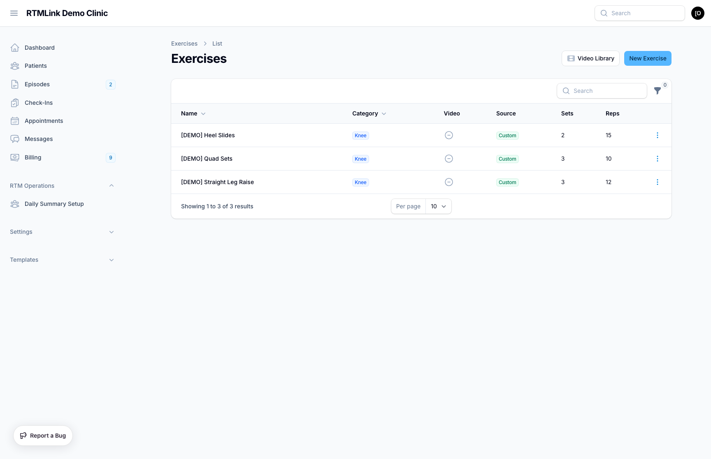

# The exercise library

The **exercise library** is your clinic's collection of exercises. Each exercise holds the instructions, images, and an optional demonstration video a patient sees, plus default prescription values (sets, reps, hold) you reuse every time you assign it. You build the library here once, then assign exercises to patients from their episodes.

Open it from **Exercises** in the left sidebar, under the **Templates** group.

## Reading the list

Each row is one exercise:

| Column | What it shows |
|--------|---------------|
| **Name** | The exercise name. A lock icon means it's private to one patient (see [Patient-specific exercises](#patient-specific-exercises)). |
| **Category** | The exercise category, shown as a badge. |
| **Video** | Whether a demonstration video is attached. |
| **Source** | Where it came from: **Platform**, **Imported**, or **Custom**. |
| **Sets** / **Reps** | The default prescription, if you've set one. |

Filter the list by **category**, by **source**, and by whether an exercise is **Patient-specific**.

## Platform, imported, and custom exercises

RTMLink ships a shared **platform library** of ready-made exercises every clinic can use:

- **Platform** exercises are read-only: you can assign them to patients, but you can't edit or delete them.
- To make one your own, use **Import from Library** at the top of the list. This copies the platform exercise into your clinic as an **Imported** exercise you can edit freely.
- **Custom** exercises are ones you created from scratch.

> **Import to customize.** If a platform exercise is *almost* right, import it first, then edit your copy. Your changes never touch the shared platform version or any other clinic.

## Creating an exercise

Click **New Exercise** and fill in the form, which is organized into sections:

**Exercise Details**
- **Name** (required).
- **Category:** the body area or function the exercise targets. The default list spans physical therapy and chiropractic (Shoulder, Knee, Hip, Spine, Core, Ankle/Foot, Wrist/Hand, Elbow, Neck, Balance & Gait), occupational therapy (Hand Therapy, Fine Motor, Daily Activities (ADL)), and speech-language pathology (Swallowing (Dysphagia), Articulation & Speech, Voice, Language), plus Cognition and General. Your clinic may use a custom set.

> Starting from something similar? Use **Copy details from exercise** to pull in another exercise's name, instructions, and default prescription. Media is never copied, so add this exercise's own images and video.

**Content**
- **Description:** a short summary.
- **Patient Instructions:** the step-by-step guidance the patient reads while doing the exercise.

**Media**
- Attach a demonstration video and up to ten **Images** (PNG, JPG, or WebP, max 2 MB each). You can paste an image straight from your clipboard with **Cmd/Ctrl + V**. See [Exercise videos](exercise-videos.md) for the video options.

**Defaults**
- **Sets**, **Reps**, and **Hold (seconds)**: the default prescription that fills in automatically when you assign this exercise. You can override these per patient at assignment time.

Editing opens the same form; **View** shows a read-only summary.

## Patient-specific exercises

Sometimes you want an exercise that belongs to a single patient, for example one holding that patient's own photos or video. When you create an exercise from a patient's episode, you can **lock it to that patient**. A locked exercise holds that patient's media, can never be assigned to anyone else, and shows a lock icon in the library.

## Related articles

- [Understanding the Home Exercise Program](understanding-hep.md)
- [Exercise videos](exercise-videos.md)
- [Exercise programs](exercise-programs.md)
- [Assigning HEP to an episode](assigning-hep-to-an-episode.md)
