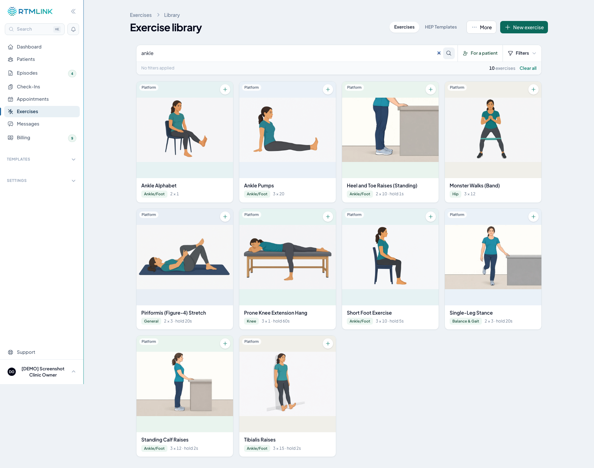

# The exercise library

The **exercise library** is where every exercise you can prescribe lives. Each exercise holds the instructions, photos, and optional video a patient sees, plus default sets, reps, hold, and rest that fill in whenever you add it to a patient's program.

Click **Exercises** in the left sidebar (it sits below **Appointments**). The page is titled **Exercise library** and has two tabs: **Exercises** and **HEP Templates** (see [HEP templates](hep-templates.md)). You'll only see it if your clinic has exercises enabled.

> **New to the rebuilt library?** A strip at the top, **A new way to build exercise programs**, offers **Show me what changed**, a short guided tour of the page. Click **Got it, hide this** to hide the strip. You can replay the tour any time from **More**, then **What's new**.

## Finding exercises

Exercises appear as cards. To narrow them down:

- **Search** by name. Search also matches the other names your team uses for an exercise (**Also known as**), its tags, and its instructions, so searching "heel raises" finds **Standing Calf Raises**.
- Click **Filters** to filter by **Source**, **Category**, **Difficulty**, or **Equipment**. Pick one option per group; click it again to clear it. Active filters show as chips you can remove, and **Clear all** resets everything.
- Click **Show more** at the bottom to load more cards.

## Reading an exercise card

Each card shows:

- The exercise's photo. A play badge means it has a video; **No photo yet** means it has neither.
- A source tag: **Platform**, **Imported**, or **Clinic** (see below).
- A lock tag if the exercise is private to one patient.
- Its category and default dose, for example `3 × 10 · hold 5s`.
- A round **+** button that adds it to the program you're building (see [Building a patient's exercise program](building-a-patients-program.md)).

Click anywhere else on the card to open the exercise's details. The details panel plays the video in place and shows the default **Sets**, **Reps**, and **Hold**, the numbered **Instructions**, and how widely it's used, for example "On 3 patients' programs · in 2 templates" (counting patients on active episodes). **Often paired with** suggests exercises your clinic tends to use alongside it. At the bottom, click **Add to program**, or **Edit** to change the exercise.

## Platform, imported, and clinic exercises

RTMLink ships a shared **platform library** of ready-made exercises that every clinic can use.

- **Platform** exercises are read-only. You can put them on any program, but you can't edit the shared originals.
- **Imported** exercises are editable copies your clinic made from a platform exercise.
- **Clinic** exercises are ones your clinic created. (The **Source** filter groups imported and clinic exercises together as your clinic's custom exercises.)

**To customize a platform exercise**, open its details and click **Duplicate & edit**. RTMLink makes an editable copy in your library (named, for example, "Bridge Variation 1") and opens it for editing. The shared original is unchanged, for your clinic and every other clinic.

## Creating an exercise

Clinic owners and providers can create exercises.

1. Click **New exercise** at the top of the library.
2. Enter the exercise name.
3. Under **Instructions**, write the steps the patient follows, **one step per line**. Each line becomes a numbered step on the patient's screen.
4. Under **Default dosage**, set **Sets**, **Reps**, **Hold (sec)**, and **Rest (sec)**. These fill in whenever you add the exercise to a program and leave those fields blank.
5. Under **Details**, fill in what helps your team find it:
   - **Category:** the body area or function it targets. Click **+** beside the field to create a new category on the spot.
   - **Difficulty:** **Beginner**, **Intermediate**, or **Advanced**.
   - **Equipment:** press Enter after each item. Leave it empty for no equipment.
   - **Tags:** labels for everything the exercise addresses (for example, shoulder flexion). Press Enter after each one.
   - **Also known as:** other names your team uses for this exercise. Searching any of them finds it.
6. Under **Media**, drop photos or a video onto the card. Photos can be JPG, PNG, WebP, AVIF, or straight from an iPhone (HEIC), up to 10 photos at 20 MB each. Large photos are resized automatically, and iPhone photos are converted as they upload. You can also paste a photo with **Cmd/Ctrl + V**. See [Exercise videos](exercise-videos.md) for video options.
7. Check the **Patient sees** card. It previews the exercise the way the patient will see it and updates as you type.
8. Click **Create**, or **Save and add to program** to create it and drop it straight into the program you're building.

> **Starting from something similar?** On the New exercise page, click **Copy details from exercise** and pick an exercise. RTMLink copies its instructions, category, difficulty, equipment, tags, and default dosage, and names the copy as a variation. Photos and video are never copied.

## Editing an exercise

Open the exercise's details and click **Edit**. When you change something, a bar appears at the top with **Save changes** and **Discard**.

> **Changes apply everywhere.** Editing a shared exercise changes it for every patient who has it. When it's in use, the top of the page says so, for example "Assigned to 3 active patients and in 1 template. Changes apply everywhere this exercise is assigned." To change it for one patient only, use **Customize this Exercise** from their episode (see [Assigning exercises to a patient](assigning-hep-to-an-episode.md#editing-an-assigned-exercise)).

## Deleting an exercise

Clinic owners can delete an exercise your clinic created or imported. Open it for editing, scroll to **Danger zone** at the bottom, click **Delete**, and confirm.

Deleting removes the exercise from your library and every picker. Patients who already have it keep it until you remove it from their program, where it shows a **Deleted from library** tag.

## Managing categories

The built-in categories cover physical therapy, occupational therapy, and speech-language pathology (for example Shoulder, Knee, Hand Therapy, and Swallowing (Dysphagia)), listed alphabetically. Clinic owners and providers can add their own:

1. Click **More** at the top of the library, then **Manage Categories**.
2. In the **Exercise Categories** window, click **Add category** and type a name.
3. Click **Save categories**.

Your categories appear in the **Category** field and filter right away. You can also add one while editing an exercise with the **+** beside **Category**.

## Patient-specific exercises

Sometimes an exercise should belong to a single patient, for example one holding that patient's own photos or video. A patient-specific exercise:

- Is created from the patient's episode, with **New Exercise for this Patient** or **Customize this Exercise** (see [Assigning exercises to a patient](assigning-hep-to-an-episode.md)).
- Shows a lock tag and **Private to** that patient.
- Appears in the library only while you're working on that patient's program, where it sorts to the top.
- Is visible only to clinic owners and the providers who treat that patient.
- Can never be assigned to anyone else or saved into a HEP template.

To make an editable copy that stays private to the same patient, open its details and click **Duplicate & edit**. Photos and video aren't copied, so add the patient's media to the copy.

## The table view

For a spreadsheet-style list, click **More**, then **Table view**. It shows each exercise's category, tags, video, source, **Created by**, and default sets and reps, with filters for each. The table view is also where clinic owners:

- **Hide** a platform exercise your clinic never uses, so it stops appearing in your library. To bring it back, set the **Hidden** filter to **Hidden only**, find the exercise, and click **Restore**.

Anyone can filter the table to the **Patient-specific** exercises they're allowed to see. Use the **Exercises** and **HEP Templates** tabs at the top, or **Library view**, to return to the cards.

## Related articles

- [Understanding the Home Exercise Program](understanding-hep.md)
- [Building a patient's exercise program](building-a-patients-program.md)
- [Exercise videos](exercise-videos.md)
- [HEP templates](hep-templates.md)
- [Assigning exercises to a patient](assigning-hep-to-an-episode.md)
