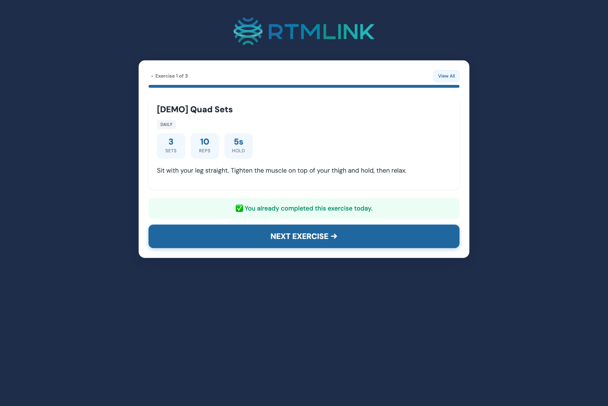

# The patient's exercise experience

This article describes what your **patient** sees, so you can guide them and make sense of the feedback that comes back. Patients don't need an app or a password. They open their exercises from the same personal link they use for check-ins.

## Getting to their exercises

The patient reaches their program from their daily check-in by tapping the **💪 Start Your Exercises** button. Your clinic decides where that button sits: at the **Top of the check-in** (the default, where it also shows on the thank-you page after they submit), or only **After the check-in is submitted** (so they finish the check-in first). You set this under **Patient Exercise Flow** in **Clinic Settings**.

The exercises open on a page titled **Your Exercises**. If you've changed their program since they last looked, a banner reads "N exercises updated since your last visit."

## Working through the exercises

By default the patient goes one exercise at a time. Each exercise shows:

- The **name**, with a **New** or **Updated** badge if you recently changed it.
- The **frequency** and the prescription (sets, reps, and hold).
- The **video** (if attached) and any **images**.
- The **instructions**.
- A **Note from your provider** block, if you added one.

They can jump between exercises with the **Exercise N of N** menu at the top, or switch to **View All** to see the whole list at once. In **View All**, each exercise has a **Done ✓** button that marks it complete right away, without the feedback questions.

## Marking an exercise done, and how it felt

When the patient finishes an exercise, they tap **Done!**, which opens a few quick questions:

1. **How did that feel?** They pick **😊 Easy**, **😐 OK**, or **😰 Hard**.
2. **Did you have any pain?** Yes or No. If they tap **Yes**, they can add a **Pain level** (None, Mild, Moderate, Strong, or Severe) and choose where they felt it from a set of body areas (Shoulder, Knee, Hip, Back, Neck, Ankle, Wrist, or Other).
3. **Additional comments**, anything they want to pass along (up to 500 characters).

To record the exercise and move on, they tap **Continue →**.

> **Every question is optional.** After tapping **Done!**, the patient can tap **Continue →** without answering anything and the completion still counts. This feedback appears alongside the patient's survey responses on the episode, so you can see how their exercises are going. See [Understanding survey responses](../surveys/understanding-survey-responses.md).

If they've already finished an exercise that day, it shows **You already completed this exercise today**, and doing it again won't double-count.

When they've gone through everything, a **Great Work!** summary shows how many they completed that day, with a **Do Now** button next to anything still left.

## After they finish

At the bottom of the summary (and the **View All** screen), the patient sees two buttons:

- **Finish your check-in →** when they still have not submitted today's check-in. Doing exercises never submits the daily survey, so this points them back to finish it. If they've already submitted, the button instead reads **Back to Home**.
- **🖨️ Print my exercises**, which opens the printable version described below.

## The printable version

A patient who prefers paper can tap **🖨️ Print my exercises** to open a clean, printer-friendly **Home Exercise Program** sheet. It lists each exercise with its image, prescription, instructions, and any note, and a **Print** button in the corner sends it to the printer. A **QR code** at the bottom, labeled "Scan for video exercises," takes them back to the digital version with the videos.

## Why it matters for billing

Each day a patient marks at least one exercise complete counts as an RTM interaction day, the same as answering a survey. Encouraging patients to use their exercise link keeps them engaged and keeps the episode billable. See [Understanding the Home Exercise Program](understanding-hep.md#how-exercise-completion-counts-toward-billing).

## Related articles

- [Understanding the Home Exercise Program](understanding-hep.md)
- [Assigning HEP to an episode](assigning-hep-to-an-episode.md)
- [Tracking exercise adherence](tracking-exercise-adherence.md)
- [Understanding survey responses](../surveys/understanding-survey-responses.md)
