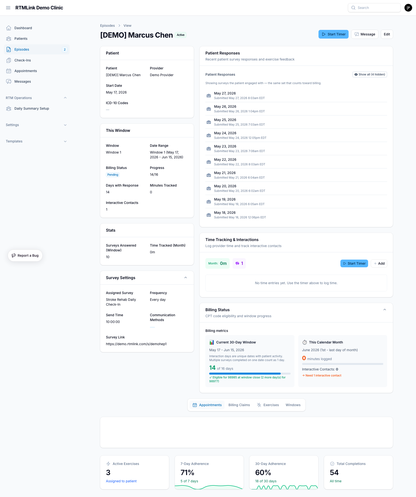

# Tracking exercise adherence

Once a patient has exercises assigned, their episode shows an **adherence summary** — an at-a-glance read on how consistently they're actually doing their HEP. It's how you spot a patient who's drifting before their next visit.

You'll find it on the patient's episode (it appears once they have at least one active exercise assigned).

## What the summary shows

| Figure | What it tells you |
|--------|-------------------|
| **Active Exercises** | How many exercises the patient currently has assigned. |
| **7-Day Adherence** | The share of the last **7 days** on which they completed at least one exercise — a percentage with a small day-by-day chart. |
| **30-Day Adherence** | The same, over the last **30 days**. |
| **Total Completions** | How many exercises they've completed, all time. |

The 7- and 30-day figures turn **green** when the patient is keeping up (about half their days or better) and **amber** when adherence is low — a quick cue for who needs a nudge.

## How adherence is counted

Adherence counts **days, not exercises**. A day counts if the patient completed **at least one** exercise that day. Doing five exercises in a day counts the same as doing one — it's one adherent day.

> This is the same "at least one completion" rule that makes a day count as a **billable interaction day**. A patient's adherence and their RTM interaction days move together — staying on top of their HEP is exactly what keeps the episode billable. See [Understanding the Home Exercise Program](understanding-hep.md#how-exercise-completion-counts-toward-billing).

## Related articles

- [Understanding the Home Exercise Program](understanding-hep.md)
- [Assigning HEP to an episode](assigning-hep-to-an-episode.md)
- [The patient's exercise experience](the-patient-exercise-experience.md)
- [Viewing episode details](../episodes/viewing-episode-details.md)
