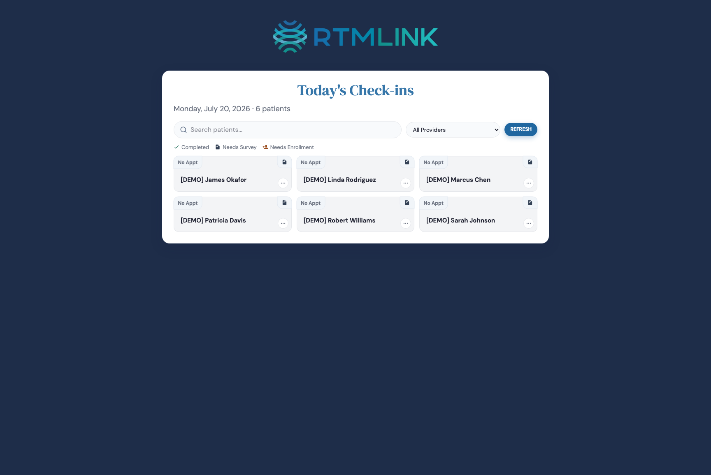

# Using the check-in kiosk

The check-in kiosk shows who is coming in today and whether each patient is set up for RTM, so your front desk can catch enrollments as patients arrive. Open the private link your clinic set up (see [Setting up check-in](setting-up-check-in.md)) on the check-in computer or tablet.

## Unlocking

If your clinic set a PIN, the kiosk opens to a **Front Desk Access** panel: enter the PIN and click **Unlock**. A wrong code shows **Incorrect PIN** and clears the box. No patient information appears until the PIN passes. If no PIN was set, the kiosk opens straight to the list.

## Reading the list

The **Today's Check-ins** screen shows today's patients as cards. Clinics connected to DrChrono see today's appointments with their times; clinics without an EHR see their active RTM patients. Each card shows the appointment time (or **No Appt**), the patient's name, and their provider and visit reason where available.

A colored status tells you where each patient stands, matching the legend:

- **Completed** (green check): the patient already did today's check-in.
- **Needs Survey**: enrolled, but today's check-in is not done. Tap the card to open their survey.
- **Needs Enrollment** (amber): not in RTM yet. Tap to enroll them, covered in [Enrolling and managing patients at check-in](enrolling-and-managing-at-check-in.md).

## Finding a patient

Use the **Search patients** box to find someone by name; it searches everyone in your clinic, not just today's list, so you can pull up a walk-in who has no appointment. The **All Providers** dropdown (and the profile filter, for DrChrono clinics) narrows the view, and **Refresh** pulls the latest schedule. When nothing matches, the kiosk says **No patients match your search**, or **No check-ins for today** when the day is empty.

## Related articles

- [Setting up check-in](setting-up-check-in.md)
- [Enrolling and managing patients at check-in](enrolling-and-managing-at-check-in.md)
