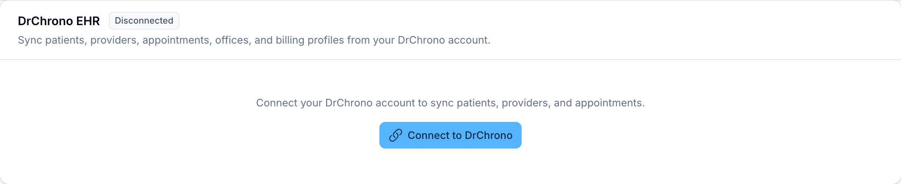

# Connecting DrChrono

RTMLink integrates with DrChrono so patients, providers, appointments, offices, and billing profiles flow in automatically, and billing claims can flow back out. This guide covers connecting the account and keeping it in sync.

## Turn on the integration

The **Integrations** page appears in the sidebar only once you have chosen DrChrono as your EMR:

1. Open **Settings** > **Clinic Settings** and set **EMR / EHR System** to **DrChrono**. Save.
2. **Integrations** now appears in the sidebar. Open it.
3. On the **DrChrono EHR** card, click **Connect to DrChrono**. You are sent to DrChrono to authorize RTMLink, then returned with the card showing **Connected**.

## What syncs

Once connected, RTMLink pulls your DrChrono providers, offices, exam rooms, appointment profiles, billing profiles, and patient appointments. Syncing runs automatically every hour, and DrChrono changes also arrive in near real time. The connected card shows counts for each type of record and when the last sync ran.

> **Do not link a billing profile to an appointment profile RTMLink exports to.** RTMLink writes every code, unit, and modifier on a claim itself, so a linked billing profile only adds lines it did not send, which then have to be removed in DrChrono before the claim goes out. See [Exporting claims and sending to DrChrono](../billing/exporting-to-drchrono.md).

## Sync now

Need the latest immediately? Click **Sync Now** on the connected card. RTMLink confirms the sync is queued and updates the **Sync Status** (Idle, Syncing, or Error) as it runs. If a sync hits a problem, a red **Sync Error** panel appears on the card, and the failed run shows up in the **Recent Sync Logs** table with a **Failed** badge. Hover, tap, or tab to the red exclamation icon beside that badge to read why that particular run failed.

## Disconnect

Click **Disconnect** and confirm to unlink the account. Syncing stops and the stored credentials are cleared; you can reconnect at any time.

## Who manages the integration

Connecting, syncing, and disconnecting are Clinic Owner tasks, and only the Clinic Owner can open the **Integrations** page. It is not available to providers, staff, billing staff, or auditors. After connecting, set up the provider and export mappings so claims export cleanly, in [DrChrono provider mappings](drchrono-provider-mappings.md).

## Related articles

- [DrChrono provider mappings](drchrono-provider-mappings.md)
- [Getting appointments into RTMLink](../appointments/syncing-appointments.md)
- [Exporting to DrChrono](../billing/exporting-to-drchrono.md)
