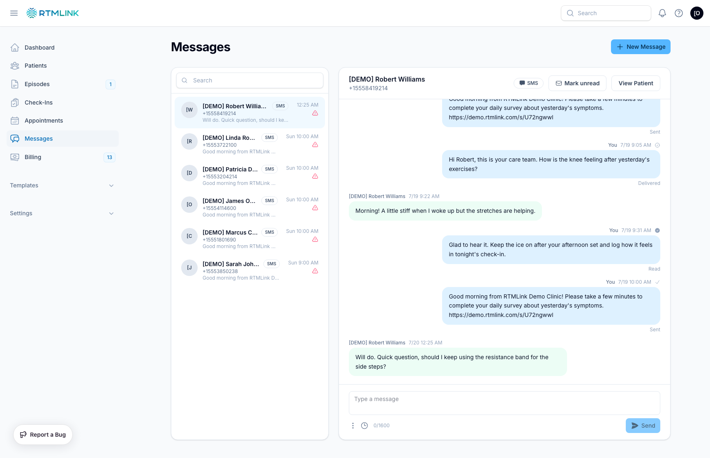

# The Messages inbox

Click **Messages** in the left sidebar to open the clinic's shared inbox. Every patient conversation, text or email, lives here in one two-pane view: conversations on the left, the open thread on the right. The sidebar item carries a badge with the total unread count so you can see at a glance when patients have written back.

## The conversation list

Each row is one patient conversation:

- The patient's name, with an **SMS** or **Email** pill showing the channel, and the number or address underneath.
- A one-line preview of the latest message and its timestamp.
- **Unread conversations** float to the top with a green dot on the avatar and a green pill counting the unread messages.
- A conversation whose last message failed to send shows a red warning icon so delivery problems stand out.

The **Search** box filters live by patient name, phone, or email. You can also find conversations from the global search bar at the top of the app; results deep-link straight into the thread.

## Reading a conversation

Click a row to open the thread. Outbound messages appear on the right labeled **You**, patient replies on the left under the patient's name, and every timestamp is shown in your clinic's timezone. Opening a conversation marks its unread messages as read automatically.

Two buttons sit in the thread header:

- **View Patient** jumps to the patient's record.
- **Mark unread** flags the conversation for follow-up: it closes the thread, floats the conversation back to the top of the list with its unread badge, and confirms with **Marked as unread**.

## Empty states

A brand-new clinic sees **No conversations yet** in the list and **Select a conversation** in the right pane. Conversations appear as soon as the first message is sent to a patient (including automatic survey invitations) or a patient writes in.

## Who can use Messages

Messaging is available to the whole care team; conversations are shared, not per-user, so anyone can pick up where a colleague left off. There is no per-message record of which teammate sent what in the thread view: outbound messages all read as **You**.

## Related articles

- [Sending messages](sending-messages.md)
- [Managing conversations](managing-conversations.md)
- [Messaging a patient](../patients/messaging-a-patient.md)
