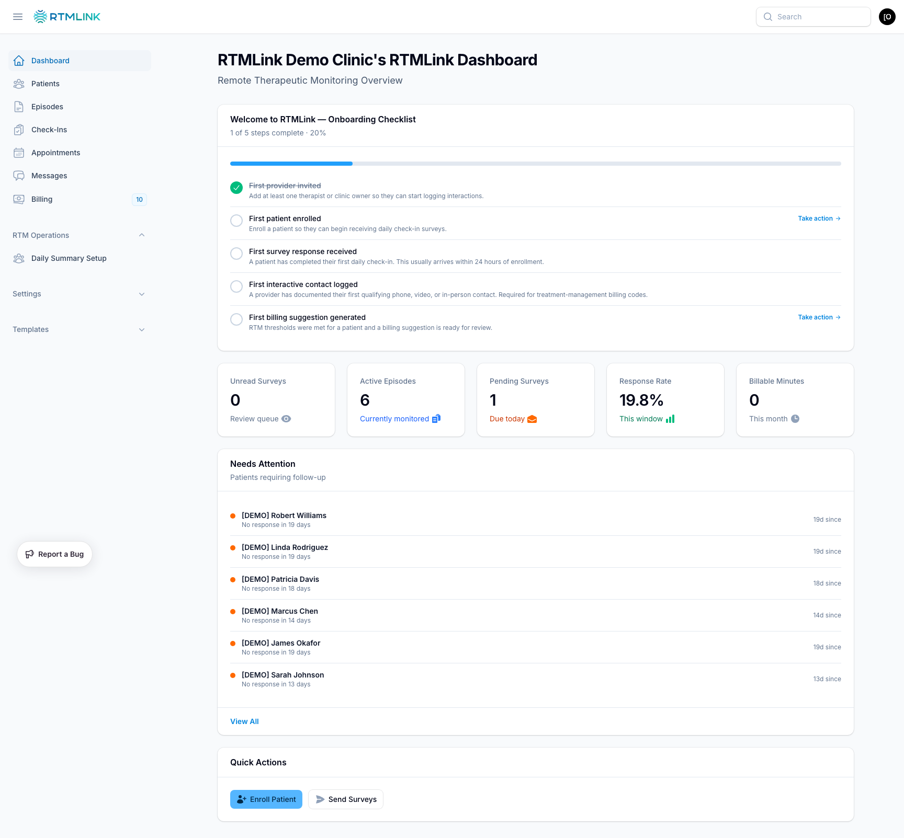

# Authoring Guide — How to Research & Write RTMLink Help Articles

> **This is the craft manual.** It covers *how* to research the code and *how* to write a high-quality article.
> - *What* each article should cover → `meta/CONTENT-OUTLINE.md`
> - *Whether* something is worth documenting → `meta/SCOPE-AND-TMI.md`
> - *Which* articles exist + their status + sources + screenshots → `meta/registry.yaml` (the keystone)

Read `AGENTS.md` (repo root) first for orientation and the golden rules. This guide assumes you've read it.

---

## Your mission

You are writing end-user help articles for **RTMLink**, a Remote Therapeutic Monitoring (RTM) platform used by physical-therapy clinics. Your audience is **clinic staff** — front-desk coordinators, providers, billing staff, clinic owners — **not developers**. Write clear, task-oriented articles that help a busy clinic user accomplish a goal.

The thing that makes these articles trustworthy: **every UI label, field, button, and navigation path is verified against the live application code before it's written.** You never guess or invent UI text.

---

## The application, in one screen

RTMLink is a **Laravel 12 + Filament v4** multi-tenant SaaS app with a **Livewire** patient portal. You don't need to understand the framework — you need to know *where to read* to find what a user sees.

| What the user sees | Built with | Where to read it |
|--------------------|-----------|------------------|
| Clinic staff admin UI | Filament v4 | `../app/Filament/Clinic/` |
| Super-admin platform UI (not for clinic users) | Filament v4 | `../app/Filament/Platform/` — **usually skip; see SCOPE-AND-TMI** |
| Patient-facing survey / exercises | Livewire + Blade | `../app/Livewire/Patient/`, `../resources/views/` |
| Front-desk check-in kiosk | Livewire + Blade | `../app/Livewire/Checkin/` |
| Data + business rules (statuses, limits) | Eloquent models | `../app/Models/` |
| Required fields, defaults, limits | Migrations | `../database/migrations/` |
| Who can do what (per role) | Policies | `../app/Policies/` |
| Workflow logic (e.g. how billing is calculated) | Services / Actions / Jobs | `../app/Services/`, `../app/Actions/`, `../app/Jobs/` |
| Demo data for screenshots | Seeder | `../database/seeders/DemoTenantSeeder.php` |

> Everything you read for accuracy lives **above** this repo at `../` (the RTMLink app). You **write** articles **here** in `rtmlink-help/`. Never edit the app from here.

---

## Where to read, per help section

Use this map to find the right source code for each section. **Verify these paths still exist** before relying on them — the app changes. (Paths are relative to the app root `../`.)

| Help Section | Primary Codebase Locations |
|-------------|---------------------------|
| **Getting Started** | `app/Filament/Clinic/Pages/Dashboard.php`, `app/Filament/Clinic/Widgets/` (`KpiCardsWidget`, `NeedsAttentionWidget`, `OnboardingChecklistWidget`, `QuickActionsWidget`), `app/Models/User.php`, `app/Models/Tenant.php`, `app/Filament/Clinic/Pages/Auth/`, `database/seeders/RolesSeeder.php` |
| **Patients** | `app/Filament/Clinic/Resources/PatientResource.php` + `PatientResource/Pages/` + `PatientResource/RelationManagers/`, `app/Models/Patient.php` |
| **Episodes & Enrollment** | `app/Filament/Clinic/Resources/EpisodeResource.php` + `EpisodeResource/Pages/` + `EpisodeResource/RelationManagers/` + `EpisodeResource/Widgets/`, `app/Models/Episode.php`, `app/Models/Window.php` (30-day billing window), `app/Models/EpisodePauseHistory.php`, `app/Services/EpisodeEnrollmentService.php`, `EpisodeLifecycleService.php`, `EpisodeWindowService.php` |
| **Surveys** | `app/Filament/Clinic/Resources/SurveyResource.php` + `SurveyResource/`, `app/Models/Survey.php`, `app/Models/SurveyQuestion.php`, `app/Models/SurveyResponse.php`, `app/Enums/QuestionType.php` |
| **Exercises / HEP** | `app/Filament/Clinic/Resources/ExerciseProgramResource/`, `ExerciseResource/`, `ExerciseVideoResource/`, `app/Filament/Clinic/Resources/EpisodeResource/RelationManagers/HepAssignmentsRelationManager.php`, `EpisodeResource/Widgets/ExerciseAdherenceWidget.php`, `app/Livewire/Patient/ExerciseWalkthrough.php`, `app/Enums/HepFrequency.php`, `ExerciseCategory.php`, `ExerciseDifficulty.php`, `ExerciseFeeling.php` |
| **Messaging** | `app/Filament/Clinic/Resources/ConversationResource/`, `app/Filament/Clinic/Pages/MessagesCenter.php`, `app/Livewire/Clinic/MessagesCenter.php`, `app/Livewire/Clinic/MessagingDrawer.php`, `app/Models/Conversation.php`, `app/Models/Message.php`, `app/Enums/Channel.php`, `ConversationStatus.php`, `MessageDirection.php` |
| **Time Tracking** | `app/Livewire/Clinic/Episodes/TimeEntriesTable.php`, `TimeTrackingWidget.php`, `InteractiveCommunicationsCard.php`, `app/Models/TimeEntry.php` |
| **Provider Summaries** | `app/Filament/Clinic/Pages/PendingSummaries.php`, `ReviewSummary.php`, `app/Services/ProviderSummary/` (`ProviderSummaryBuilder`, `ProviderSummaryNotifier`, `ClinicOwnerDigestService`, `UnreadSurveyService`) — *no `ProviderSummary` model; summaries are built by services* |
| **Billing & Claims** | `app/Filament/Clinic/Resources/BillingSuggestionResource/`, `app/Filament/Clinic/Pages/BillingSettings.php`, `app/Models/BillingSuggestion.php`, `app/Models/BillingClaim.php`, `app/Models/Window.php`, billing services (`BillingSuggestionService`, `BillingSuggestionGenerationService`, `BillingExportService`, `RtmCounterService`, `EpisodeWindowService`) |
| **Appointments** | `app/Filament/Clinic/Pages/Appointments.php`, `PatientResource/RelationManagers/PatientAppointmentsRelationManager.php`, `EpisodeResource/RelationManagers/AppointmentsRelationManager.php`, `app/Models/Appointment.php` |
| **Check-In** | `app/Livewire/Checkin/FrontDeskCheckin.php`, `resources/views/livewire/checkin/` |
| **Patient Portal** | `app/Livewire/Patient/SurveyForm.php`, `app/Livewire/Patient/ExerciseWalkthrough.php`, `routes/tenant.php` (survey magic links `/s/{token}`, `/patient-portal`) |
| **Settings** | `app/Filament/Clinic/Pages/ClinicSettings.php`, `BillingSettings.php`, `Integrations.php`, `ProviderNotifications.php`, `app/Models/Tenant.php`, `app/Models/ProviderNotificationSetting.php` |
| **User Management** | `app/Filament/Clinic/Resources/UserResource/`, `app/Models/User.php`, `app/Policies/`, `database/seeders/RolesSeeder.php` |
| **Clinical Note Templates** | `app/Filament/Clinic/Resources/ClinicalNoteTemplates/`, `app/Models/ClinicalNoteTemplate.php` |
| **Message Templates** | `app/Filament/Clinic/Resources/MessageTemplates/`, `app/Models/MessageTemplate.php`, `app/Enums/TemplateType.php` |
| **Profile** | `app/Filament/Clinic/Pages/Profile.php`, `app/Filament/Clinic/Pages/InitialPasswordSetup.php` |
| **Integrations (DrChrono)** | `app/Filament/Clinic/Pages/Integrations.php`, `app/Services/Ehr/` (`DrChronoClient`, `DrChrono*SyncService`, `DrChronoAppointmentExportService`) |

> **If the outline lists a feature you can't find in the code, do not document it.** Note it in `meta/registry.yaml` (set the article `status: blocked` with a comment) and move on. Documenting unbuilt features is a golden-rule violation.

---

## The 7-step research process (do this for *every* article)

> **Step 0 — pin the production baseline.** Before reading any file, run `git -C .. fetch origin main`. Read every source below from **`origin/main`** (production) — e.g. `git show origin/main:app/Filament/Clinic/Resources/PatientResource.php` — **never** the working tree or `git rev-parse HEAD`. The parent app is usually checked out on an unmerged feature branch, so the working tree can show UI that isn't live yet; documenting it ships lies to clinics. (See `AGENTS.md` Golden rule #1.)

```
Step 1 — Read the Filament Resource or Page
         → table columns, form fields, actions, filters, infolist entries
         → this is literally what the user sees and can click

Step 2 — Read the Eloquent Model
         → $fillable, casts(), relationships, scopes, constants
         → the data structure and business rules behind the screen

Step 3 — Read the Migration(s)
         → column types, defaults, nullable, length limits
         → required vs optional fields, allowed values, character limits

Step 4 — Read the Policy (if one exists)
         → which roles can view / create / edit / delete
         → powers the "Role Permissions" table in the article

Step 5 — Read related Services / Actions / Jobs
         → business logic: how billing windows close, how summaries generate
         → essential for the "How It Works" section

Step 6 — Read related Livewire components (patient-facing features)
         → app/Livewire/ for logic, resources/views/ for the Blade template
         → what the patient actually sees on their phone

Step 7 — Check the feature spec (deep reference only, if needed)
         → ../docs/blueprint/features/ and ../docs/specs/
         → use to understand intent; the CODE still wins on accuracy
```

### What to extract at each layer

**From a Filament Resource:**
- **Table columns** → field descriptions
- **Table filters** → the "filtering & searching" section
- **Table actions / bulk actions** → "what you can do" / "managing multiple items"
- **Form schema** → the field-by-field "creating / editing" steps
- **Infolist schema** → the "viewing details" section
- **Navigation label / group** → where the user finds it in the sidebar

**From a Model:**
- **Constants / enums** → status values, types, categories the user will see verbatim
- **Relationships** → how things connect ("each episode belongs to a patient")
- **Casts** → dates, money, booleans that affect display
- **Accessors** → computed values shown on screen

**From a Policy:**
- **Per-role allow/deny** → the Role Permissions table
- **Conditional logic** → when an action is hidden or disabled

> **Heads-up: most features have no dedicated Policy class.** Only a couple exist (e.g. `ExerciseVideoPolicy`). Authorization is mostly **role/permission-based** (spatie permissions seeded in `../database/seeders/RolesSeeder.php`) and enforced inside Filament resources/pages (e.g. `canViewAny()`, action `visible()`/`authorize()` checks). So to fill the Role Permissions table, read **`RolesSeeder.php`** + the resource's own visibility methods, not a `*Policy.php` file that may not exist.

> Enums live in `../app/Enums/`. **Not every status has an enum** — some are model constants or plain string columns (e.g. there is currently no `EpisodeStatus` enum; episode status is defined on the `Episode` model). Always confirm the actual allowed values where they're defined, not where you'd expect them.

---

## Recurring gotchas when reading the code

These are the traps that cost real time. A field or resource *existing in the code* does not mean a clinic user *sees* it — and the code's storage shape often differs from how the app reads it. Check these before you write.

- **Features can be hidden behind a settings flag.** Some sections only appear when the clinic has them enabled, and the flag often lives in the tenant's **`settings` JSON**, not as a column — e.g. `exercises_enabled` resolves to `settings.exercises.enabled` through an accessor (so grepping the model for the flag name finds nothing). When a resource/page guards itself with `shouldRegisterNavigation()` or `visible(fn () => tenant()->some_flag)`, the whole feature can vanish for a clinic. **Lead the article with the condition** ("If your clinic has exercises enabled…") and don't assume every clinic sees it.

- **Many features have a Platform "template" twin — document only the Clinic side.** A feature commonly has a **Platform** resource (a super-admin template library, `app/Filament/Platform/…Template…`) *and* a **Clinic** resource the clinic actually uses. Surveys and exercises both do this. The Platform side is out of scope (see SCOPE-AND-TMI); the clinic works from a *copy*. Document the Clinic resource; mention "your clinic starts from a shared library" only if the user acts on it.

- **Document the *rendered* surface, not the schema.** A column in `$fillable` or a resource in the codebase is not proof the user sees it. The `difficulty` field exists on the Exercise model but is rendered in **no** form, table, or view — so it isn't documented. The Video Library resource exists but sets `shouldRegisterNavigation() = false`, so it's **not in the sidebar** (reached only from inside the exercise form). Confirm a thing is actually rendered before writing it up — read the Resource's `form()`/`table()`/`infolist()`, not just the model.

- **The sidebar label may not match the entity's name.** The nav can read "Check-In Templates" while every button, page heading, and field calls the thing a "survey." **Lead with the nav label** so the user can find it ("Open **Check-In Templates** in the sidebar"), then use the entity's own word for the thing itself ("each **survey**…"). Verify both; don't assume they're the same.

- **`audience: patient` means *about* the patient surface — the reader is still clinic staff.** Those articles describe what the patient sees so staff can support them ("Here's what your patient sees when they open their link"), written in the same staff-facing second person. Don't write instructions aimed at a patient who will never open this help center.

- **For a big feature, map first, then verify the load-bearing labels yourself.** Reading 25+ files serially is slow. Send a code-explorer subagent to produce a labelled map of the feature (resources, fields, flows, enums) — then **personally re-read the few highest-stakes screens** (the create form, the key actions) to confirm the exact labels before you write them. Trust the map for breadth; trust your own reads for the words you'll publish.

---

## Writing style

**Voice & tone**
- **Second person:** "You can enroll a patient by…"
- **Active voice:** "Click **Save**," not "the record should be saved"
- **Present tense:** "The system sends a survey," not "will send"
- **Friendly but professional:** this is healthcare software — clear and trustworthy, never cute
- **Task-oriented:** lead with the goal the user is trying to achieve

**Plain language — never use developer/internal jargon.** Banned words in published articles: *Filament, Livewire, Eloquent, migration, tenant, Blade, model, resource, enum, webhook, queue, job, repository*. Say "clinic," not "tenant." Say "the patient list," not "the Patient resource."

### Article template

Every article follows this shape (omit sections that don't apply; a short article is fine). **Default to the steps.** Include Overview and How It Works only when the reader genuinely needs context first; when in doubt, cut straight to the numbered steps. Small, actionable steps beat long prose, so favor a short numbered list with one action per line over an explanatory essay.

```markdown
# Article Title

One or two sentences on what this article covers.

## Overview

What this feature is and why it matters (2–3 sentences).

## How It Works

The concept or workflow at a high level, before the click-by-click steps.

## Step-by-Step Instructions

### Doing the Thing

1. Go to **Section Name** in the left sidebar.
2. Click the **Create** button.
3. Fill in the fields:
   - **Field Name:** what it's for and any constraint (e.g. required, max length).
   - **Another Field:** description and allowed values.
4. Click **Save**.

> **Note:** Important callouts, warnings, and "gotchas" go in blockquotes.



## Understanding [Concept]

Explain statuses, calculations, or concepts the user needs (e.g. what an "interaction day" is).

## Role Permissions

| Action | Clinic Owner | Provider | Staff | Billing Staff | Auditor |
|--------|:-:|:-:|:-:|:-:|:-:|
| View   | Yes | Yes | Yes | Yes | Yes |
| Create | Yes | No  | Yes | No  | No  |
| Edit   | Yes | No  | Yes | No  | No  |
| Delete | Yes | No  | No  | No  | No  |

## Related Articles

- [Related article](../section/article.md)
```

> Fill the Role Permissions table from the **Policy class** (Step 4), not from assumption. If a feature has no policy restrictions, you can drop the table or say "available to all clinic users."

### Formatting rules

- **Bold** for UI element names: buttons, menu items, field labels, page titles (`**Save**`, `**Needs Attention**`).
- `code` for system values the user sees literally: CPT codes (`98977`), status keys, tokens.
- `>` blockquotes for tips, warnings, notes.
- Tables for comparing options, listing statuses, role permissions.
- Numbered lists for sequential steps; bullets for non-sequential info.
- Keep paragraphs short. Clinic staff scan; they don't read.
- **No em-dashes (—) or en-dashes (–).** They read as AI-written, which undercuts trust. Use commas, parentheses (like this), colons, or semicolons instead, even when the grammar is slightly less polished. A plain hyphen (-) is fine only where a real hyphen belongs (for example, "30-day window"). The most common slip is a definition bullet: write `**Term:** meaning`, never `**Term** (em-dash) meaning`. **CI rejects any changed article that contains one**, so clean the whole file you touch, not just your additions.
- **Lead with steps, not essays.** One action per numbered line. If you catch yourself writing a paragraph that explains three things, split it into three steps. Put the *why* in a one-line aside or a short blockquote, never a wall of prose.

### Do / Don't

**Do**
- Verify every label, field, and path against the actual code (the whole point).
- State role restrictions when they apply ("Only Clinic Owners and Staff can…").
- Explain *why* when behavior is non-obvious (e.g. why a billing code only appears after a window closes).
- Link related articles.
- Route the reader to the right help. For clinic-internal matters (user accounts, permissions, restoring a record), keep pointing to "your clinic administrator." For anything wrong with RTMLink itself, or that a clinic admin cannot fix (a bug, a how-to gap, a question about RTMLink billing or your account), point to RTMLink support: email [support@rtmlink.com](mailto:support@rtmlink.com) or open a ticket at [support.rtmlink.com/forms/rtmlink-support](https://support.rtmlink.com/forms/rtmlink-support).

**Don't**
- Guess at UI labels — always confirm in the resource/page code.
- Use developer jargon (see banned list).
- Document Platform/super-admin-only features (not for clinic users — see SCOPE-AND-TMI).
- Document features that don't exist yet.
- Pad. If the answer is three sentences, write three sentences.

---

## Screenshots (automated, demo tenant only)

Screenshots are **generated by an automated harness**, not captured by hand. This keeps them consistent, repeatable, and — critically — **sourced only from the demo clinic**, never from real patient data.

> **PHI rule (non-negotiable):** Screenshots come from the **demo clinic only** — `demo.rtmlink.com`. **NEVER** screenshot the real Tula clinic (`tula.rtmlink.com`) or any real patient. (And never put a `.test` local-dev address in a published guide — the live site is `rtmlink.com`.) The demo clinic's patients are fake (`[DEMO]`-prefixed: Sarah Johnson, Marcus Chen, etc.) and safe to show.

### How to declare, capture, and embed

The full mechanics — the registry schema (`role`/`url`/`wait_for`/`output` plus `selector` crops, `steps` click-navigation, and `auth: false` magic-link pages), seeding demo data, the harness commands, and embedding — live in **`meta/SCREENSHOTS.md`**. As an author, your job is just to **declare** the screenshots an article needs in the registry and **embed** them; the **Visualizer** agent captures them.

### When to add a screenshot

Screenshot **high-value, stable** screens only — dashboards, primary list views, key forms. **Don't** screenshot every field, modal, or anything that changes every release. Most articles need zero. See `meta/SCOPE-AND-TMI.md` for the screenshot filter.

For a **step-by-step** article, a small **cropped, highlighted** shot of the exact control a step acts on (a ringed button or field) is worth far more than another full-page image. Declare it with `selector` (crop to a wrapper) plus `highlight` (ring the control inside it); see `meta/SCREENSHOTS.md`. Use these on the load-bearing "do this" steps, not every one.

---

## Quality checklist (run before setting `status: review`)

- [ ] Every field name matches the actual form/table column label in the code.
- [ ] Every button/action name matches the actual action label.
- [ ] Every navigation path is accurate (sidebar → page → section).
- [ ] Role permissions verified against the Policy class.
- [ ] Status values match the actual enum/constant definitions.
- [ ] Any stated limits (character counts, required fields) match the migration/validation.
- [ ] No developer jargon slipped through (scan for the banned words).
- [ ] No em-dashes or en-dashes anywhere in the file: `grep -nE '—|–'` returns nothing (CI blocks any changed article that has one). Clean the whole file you touched, not just your edits.
- [ ] Article follows the template; paragraphs are short and scannable.
- [ ] Screenshots (if any) are declared in `registry.yaml`, generated from the **demo** tenant, and referenced with a correct relative path.
- [ ] Related articles are linked.
- [ ] `meta/registry.yaml` updated: `status: review` and `last_reviewed_commit` set to production HEAD (`git -C .. rev-parse origin/main`), not the working-tree HEAD.
- [ ] If new, the article is added to `SUMMARY.md` so GitBook publishes it.

---

## The authoring loop (one article, start to finish)

1. Open `meta/registry.yaml`; pick the next article with `status: todo` (follow priority order). Set it `status: drafting`.
2. Confirm scope in `meta/SCOPE-AND-TMI.md` — is it worth an article? worth screenshots?
3. Read its `sources` via the 7-step process. Verify the paths exist.
4. Read its content outline in `meta/CONTENT-OUTLINE.md`.
5. Write the article using the template and style above.
6. Declare/confirm screenshots in the registry; run the harness.
7. Run the quality checklist. Set `status: review`, set `last_reviewed_commit` to `origin/main`'s SHA (`git -C .. rev-parse origin/main`).
8. Add the article to `SUMMARY.md` if it's new.
9. Changes ship via **PR for human review** — never auto-publish healthcare content.
