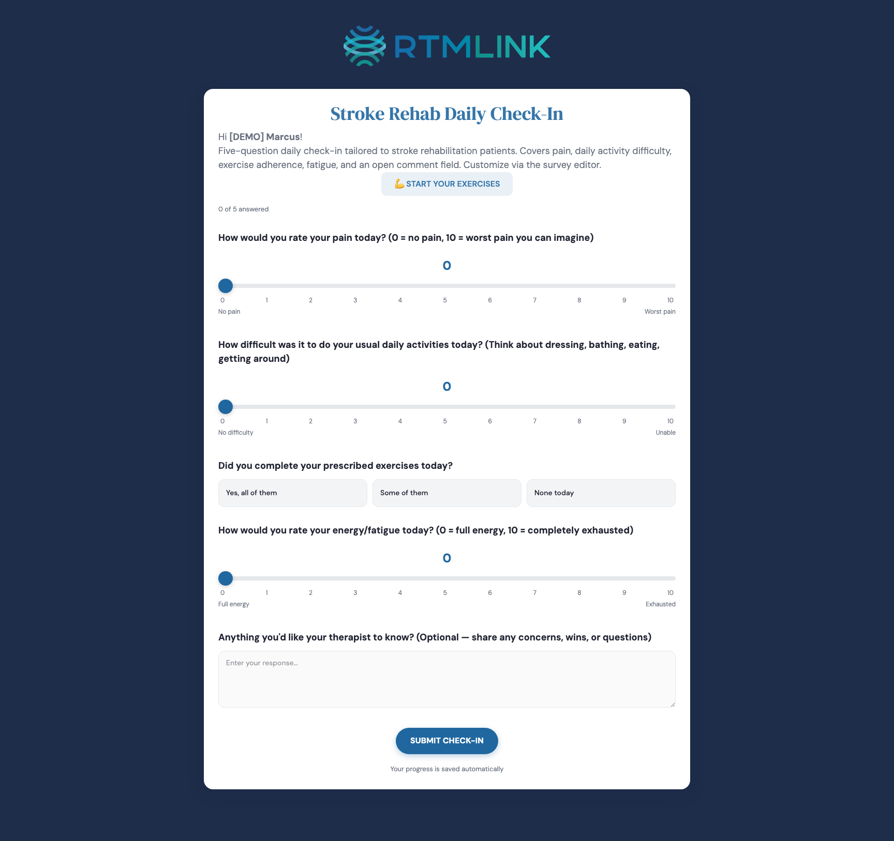

# Taking a survey

Patients complete their daily check-in from a link texted or emailed to them, with no app to install and no password to remember. This article walks through what they see, so you can help when a patient has a question.

## Opening the link

The patient taps their personal link (it looks like `.../s/` followed by a short code) and lands directly on today's check-in, branded with your clinic's logo and colors. There is nothing to log into; the link is their key.

## The one-time consent step

If your clinic requires digital RTM consent, the very first time a patient opens their link they see a short **Before your first check-in** page. They tick **I have read and agree to participate in the remote monitoring program** and tap **I Agree** to continue. They will only see this once. (A patient can also decline; their care team is notified, and they can agree later.)

## Answering the questions

The check-in is designed for a phone:

- Multiple-choice and yes/no questions are big tappable buttons, and the page scrolls to the next question automatically.
- Scale questions (like a 0 to 10 pain rating) use a slider.
- Number and text questions use a simple field.

Every question is optional, so a patient can answer what is relevant and skip the rest; a progress line shows how many they have answered.

## Nothing gets lost

Answers save automatically as the patient taps, and the footer confirms **Your progress is saved automatically**. If they close the link and come back later the same day, their answers are still there. When they are done, they tap **Submit Check-In**.

## The thank-you page

After submitting, the patient sees a thank-you message, their recent check-ins, and, if your clinic uses exercises, a **Start Your Exercises** button. See [The patient's exercise experience](../exercises/the-patient-exercise-experience.md).

If a patient's link ever stops working, see [Recovering portal access](recovering-portal-access.md).

## Related articles

- [Survey history and amendments](survey-history-and-amendments.md)
- [Recovering portal access](recovering-portal-access.md)
- [Understanding survey responses](../check-ins/understanding-survey-responses.md)
