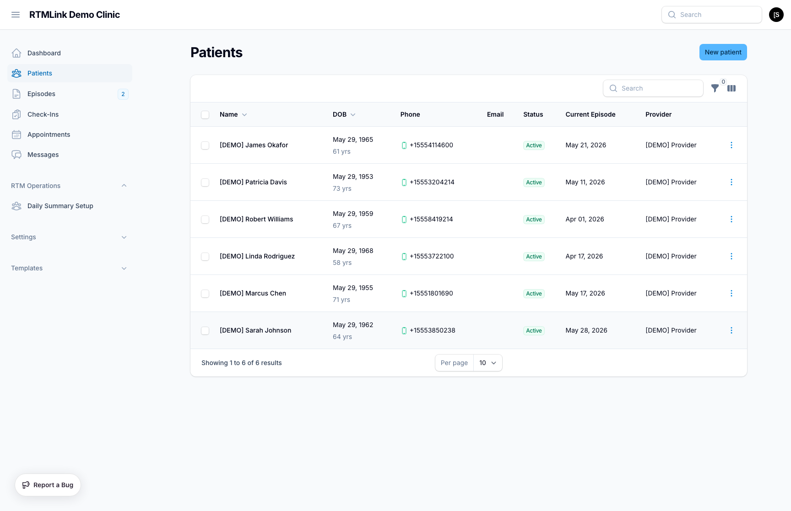

# Viewing & searching patients

The patient list is your roster of everyone your clinic cares for in RTMLink. From here you can find anyone in seconds, see who's actively being monitored, and jump straight to a patient's record or episode.

## Opening the patient list

Click **Patients** in the left sidebar. You'll see every patient at your clinic, newest first.

If your clinic is brand new, you'll see **No patients yet** with a button to **Add your first patient**. Otherwise, each row is one patient.

## What each column tells you

- **Name** — the patient's full name. Click it to open their record.
- **DOB** — date of birth, with the patient's age shown beneath it.
- **Phone** — the mobile number. A small phone icon means SMS texting is switched on for that patient.
- **Email** — the patient's email address, if you have one on file.
- **Status** — where the patient stands in monitoring right now: **Active**, **Paused**, **Completed**, **Discharged**, or **Not enrolled** if they don't have a current episode.
- **Current Episode** — the start date of the patient's active or paused episode. Click it to open that episode. Shows **None** if they aren't enrolled.
- **Provider** — the patient's primary provider.

> The **Status** column reflects the patient's *current episode*, not the patient themselves. A patient with no episode shows **Not enrolled** — that's your cue they may be ready to start monitoring.

You can show or hide the **Email**, **Current Episode**, **Provider**, and **Created** columns using the column toggle above the table. **Created** (the date the patient was added) is hidden until you turn it on.

## Searching for a patient

Type into the search box above the list to find a patient by **name**, **phone number**, or **email**. Name search matches first name, last name, and nickname, so a patient who goes by "Bob" will turn up even if they're recorded as "Robert."

You can also use the **global search** at the very top of the screen to jump to a patient from anywhere in RTMLink — it searches the same fields and shows each match's phone, email, and provider so you can pick the right person.

## Narrowing the list with filters

Click the filter control above the table to focus the list:

- **Provider** — show only patients assigned to a specific provider.
- **SMS Consent** — show patients who have opted in to, or out of, text messages.
- **Email Consent** — show patients who have opted in to, or out of, email.
- **Has Email** — show only patients who do (or don't) have an email address on file.

Filters stack, so you can combine them — for example, one provider's patients who have no email on file.

## Opening a patient

Click a patient's **name** to open their record, where you can review their details, manage consent, message them, and start or view their episode. See [Editing patient information](editing-patient-information.md).

## Who can see patients

The patient list is available to your whole clinic team. Who can manage your team and account settings depends on role — see [Understanding your role](../getting-started/understanding-your-role.md).

## Related articles

- [Creating a new patient](creating-a-new-patient.md)
- [Editing patient information](editing-patient-information.md)
- [Patient consent & messaging permissions](patient-consent-management.md)
- [Messaging a patient](messaging-a-patient.md)
