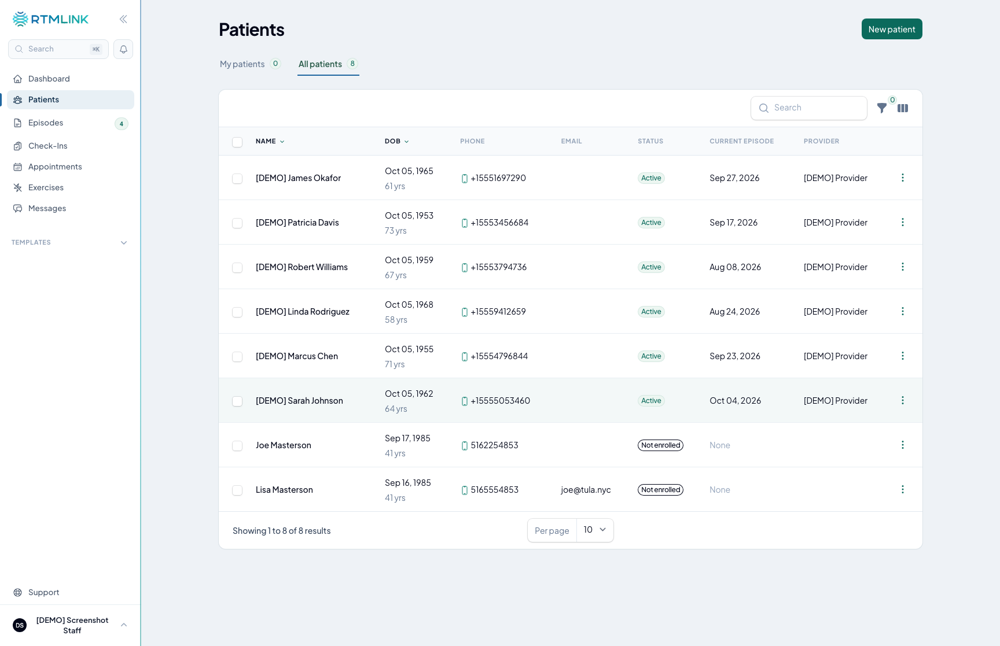

# Viewing & searching patients

The patient list is your roster of everyone your clinic cares for in RTMLink. From here you can find anyone in seconds, see who's actively being monitored, and jump straight to a patient's record or episode.

## Opening the patient list

Click **Patients** in the left sidebar. You'll see every patient at your clinic, newest first.

If your clinic is brand new, you'll see **No patients yet** with a button to **Add your first patient**. Otherwise, each row is one patient.

## My patients vs. all patients

Two tabs sit above the list, each showing a count:

- **My patients:** everyone whose primary provider is you.
- **All patients:** everyone at your clinic.

RTMLink remembers which tab you last opened and brings you back to it next time, on any device. Until you pick one, providers who have patients assigned to them start on **My patients**, while clinic owners, staff, and providers with no assigned patients start on **All patients** so the list is never empty.

> If your **My patients** tab is empty, you'll see **No patients assigned to you yet** with a prompt to switch to **All patients** and see everyone at the clinic.

## What each column tells you

- **Name:** the patient's full name. Click it to open their record.
- **DOB:** date of birth, with the patient's age shown beneath it.
- **Phone:** the mobile number, with a small icon that shows the patient's texting status at a glance. A green phone icon means SMS texting is switched on. A warning icon means the mobile carrier is blocking texts to this number (see below). No icon means the patient hasn't given SMS consent.
- **Email:** the patient's email address, if you have one on file.
- **Status:** **Active** if the patient has an episode being monitored right now, or **Not enrolled** if they don't.
- **Current Episode:** the start date of the patient's active episode. Click it to open that episode. Shows **None** if they aren't enrolled.
- **Provider:** the patient's primary provider.

> The **Status** column reflects the patient's *current episode*, not the patient themselves. A patient with no active episode shows **Not enrolled**, which is your cue they may be ready to start (or re-start) monitoring.

> **When the carrier is blocking texts:** a warning icon on the **Phone** column means the patient's mobile carrier has stopped delivering your texts, usually because the patient replied **STOP**. Turning SMS consent back on does not lift this block. The patient has to text **START** to your clinic's texting number, and the warning clears on its own once a message gets through. Hover over the icon to see the full explanation. See [Patient consent & messaging permissions](patient-consent-management.md).

You can show or hide the **Email**, **Current Episode**, **Provider**, and **Created** columns using the column toggle above the table. **Created** (the date the patient was added) is hidden until you turn it on.

## Searching for a patient

Type into the search box above the list to find a patient by **name**, **phone number**, or **email**. Name search matches first name, last name, and nickname, so a patient who goes by "Bob" will turn up even if they're recorded as "Robert."

You can also use the **global search** at the very top of the screen to jump to a patient from anywhere in RTMLink. It searches the same fields and shows each match's phone, email, and provider so you can pick the right person.

## Narrowing the list with filters

Click the filter control above the table to focus the list:

- **Provider:** show only patients assigned to a specific provider. This list includes clinic owners who treat patients, so an owner can filter down to their own caseload too.
- **SMS Consent:** show patients who have opted in to, or out of, text messages.
- **Email Consent:** show patients who have opted in to, or out of, email.
- **Has Email:** show only patients who do (or don't) have an email address on file.
- **Phone needs review:** a toggle that narrows the list to imported patients whose phone number is waiting for someone to confirm before it can be used.

Filters stack, so you can combine them, for example one provider's patients who have no email on file. Whatever you choose stays applied as you move around RTMLink and come back, until you clear it.

> A patient turns up under **Phone needs review** when their phone number came in from a connected EHR but couldn't be used as it arrived (for example, the value carried extra text or looked like it might be a caregiver's number). Rather than risk texting the wrong number, RTMLink holds it for a person to check. The flag clears as soon as someone saves a valid phone number for that patient, which is also part of the enrollment steps. If your clinic doesn't import patients from an EHR, this filter simply finds nobody.

## Opening a patient

Click a patient's **name** to open their record, where you can review their details, manage consent, message them, and start or view their episode. See [Editing patient information](editing-patient-information.md).

## Who can see patients

The patient list is available to your whole clinic team. Who can manage your team and account settings depends on role, see [Understanding your role](../getting-started/understanding-your-role.md).

## Related articles

- [Creating a new patient](creating-a-new-patient.md)
- [Editing patient information](editing-patient-information.md)
- [Patient consent & messaging permissions](patient-consent-management.md)
- [Messaging a patient](messaging-a-patient.md)
