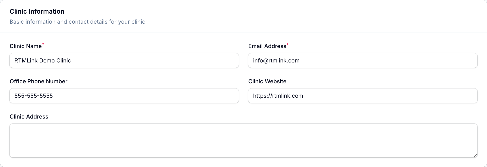
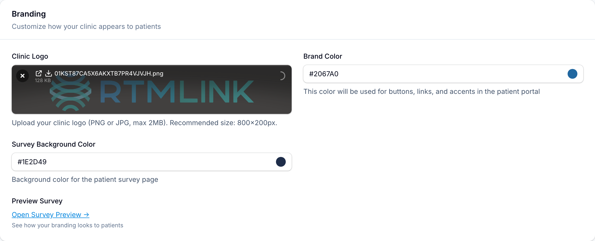

# Clinic information and branding

The top of **Clinic Settings** is where you set who your clinic is and how it looks to patients. This guide covers the first four sections; save the page when you are done and the changes take effect immediately.

## Clinic Information

Basic contact details for your clinic:

- **Clinic Name** and **Email Address** are required.
- **Office Phone Number**, **Clinic Website**, and **Clinic Address** are optional.

## Business Hours & Timezone

Set your **Timezone** first: it governs every date and time RTMLink shows, from appointment times to survey timestamps to billing windows. Getting it right keeps the whole app aligned with your clinic's day.

**Opening Time** and **Closing Time** use 24-hour format (09:00 for 9am, 17:00 for 5pm), and default to a 9-to-5 day.

## Branding

Control how your clinic appears to patients on their survey page:

- **Clinic Logo**: a PNG or JPG up to 2 MB. The recommended size is 800x200 pixels.
- **Brand Color**: used for buttons, links, and accents in the patient portal.
- **Survey Background Color**: the background of the patient survey page.

Once you have an active survey, an **Open Survey Preview** link appears here so you can see exactly how your branding looks to a patient before anything goes out.

## Email Settings

**Email From Name** is the name patients see in the "From" field of survey emails, for example "Tula Physical Therapy". Leave it blank to use your clinic name.

## Related articles

- [Clinic settings overview](clinic-settings-overview.md)
- [Security and compliance](security-and-compliance.md)
- [Previewing a survey](../check-ins/previewing-a-survey.md)
