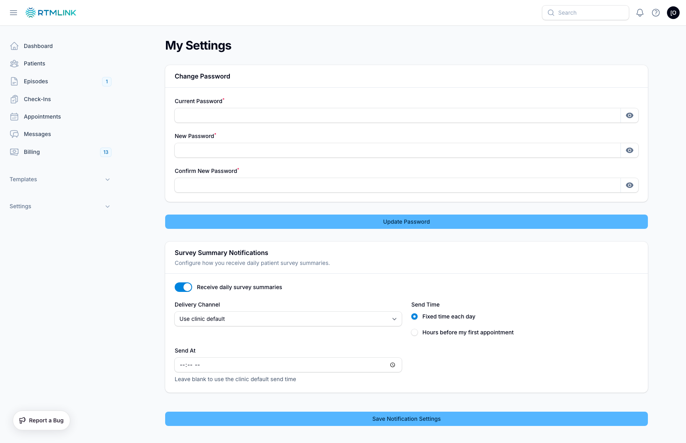

# Managing your account

Every team member controls their own account from **My Settings**, reached from the user menu in the top-right corner. This is separate from Clinic Settings; it affects only you.

## Setting your first password

New team members do not receive a password from an administrator. Instead, you get a welcome email with a secure sign-in link. Opening it brings you to a **Welcome** screen where you choose your own password, and from then on you sign in with it normally.

If your welcome link has expired, ask a clinic owner to resend it from the clinic's user list.

## Changing your password

In **My Settings**, the **Change Password** form asks for:

- **Current Password**: your existing password, to confirm it is you.
- **New Password** and **Confirm New Password**: the new one, entered twice.

Save it and RTMLink confirms with **Password updated successfully**. Each field has a reveal icon if you want to check what you typed.

## Your notification preferences

My Settings also holds your **Survey Summary Notifications**: whether you receive the daily summary, by email or text, and when. Those settings and how they interact with the clinic defaults are covered in [Summary notification settings](../check-ins/summary-notification-settings.md).

## Related articles

- [Summary notification settings](../check-ins/summary-notification-settings.md)
- [Clinic settings overview](clinic-settings-overview.md)
- [Understanding your role](../getting-started/understanding-your-role.md)
