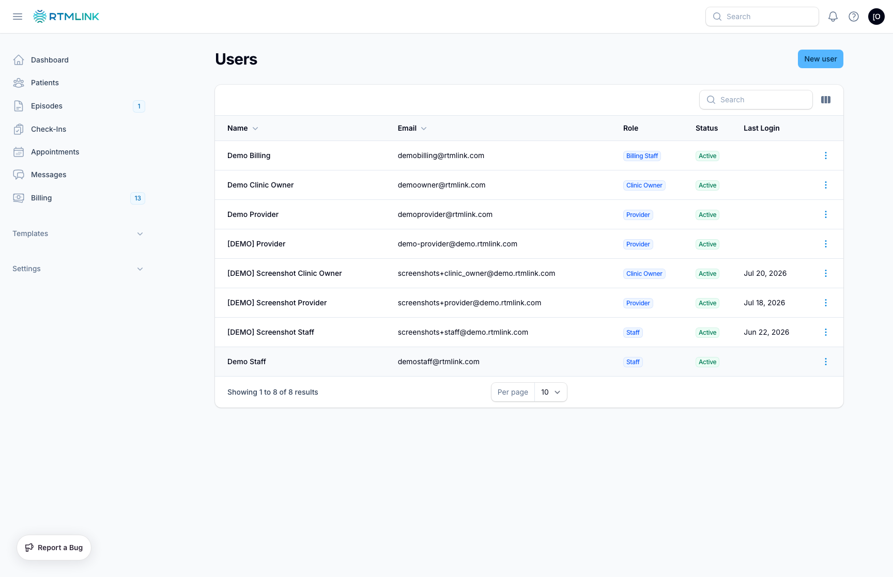

# Adding team members

New team members are invited, not assigned a password. You add them with a role, RTMLink emails them a secure sign-in link, and they choose their own password from it.

## Inviting someone

1. Open **Settings** > **Users** in the left sidebar.
2. Click **New user**.
3. Fill in the **User Details**:
   - **Name** (required)
   - **Credentials**, such as "PT" or "DPT" (optional)
   - **Email** (required, and unique within your clinic)
   - **Role** (required, see below)
4. Save. RTMLink emails the new member a welcome message with a sign-in link.

## The roles

| Role | For |
| --- | --- |
| **Clinic Owner** | full run of the clinic, including team and settings |
| **Provider** | reviews their patients, logs time, signs their claims |
| **Staff** | front-desk and patient support, no billing |
| **Billing Staff** | claims and billing, read-only on clinical records |
| **Auditor** | read-only across the whole clinic |

For what each role can do in detail, see [Understanding your role](../getting-started/understanding-your-role.md).

## How the new member gets in

The welcome email link brings them to a **Welcome** screen where they set their own password; from then on they sign in normally. You never see or set their password. If the link expires before they use it, resend it from the user list (see [Managing your team](managing-your-team.md)).

## Who can add team members

Adding and inviting team members is a Clinic Owner task.

## Related articles

- [Managing your team](managing-your-team.md)
- [Understanding your role](../getting-started/understanding-your-role.md)
- [Managing your account](../settings/managing-your-account.md)
